---
## Front matter
lang: ru-RU
title: "Лабораторная работа №1"
subtitle: "Установка и конфигурация операционной системы на виртуальную машину"
author:
    Лилия М. Пономарёва
    НПИбд-02-19\inst{1}
institute: |
	\inst{1}RUDN University, Moscow, Russian Federation
date: 2022, 19 March, Moscow, Russian Federation  

## Formatting
mainfont: PT Serif
romanfont: PT Serif
sansfont: PT Sans
monofont: PT Mono
toc: false
slide_level: 2
theme: metropolis
header-includes: 
 - \metroset{progressbar=frametitle,sectionpage=progressbar,numbering=fraction}
 - '\makeatletter'
 - '\beamer@ignorenonframefalse'
 - '\makeatother'
 - \usepackage[T2A]{fontenc}
 - \usepackage{amsmath}
aspectratio: 43
section-titles: true
---

# Цель работы
Целью данной работы является приобретение практических навыков
установки операционной системы на виртуальную машину, настройки минимально необходимых для дальнейшей работы сервисов.

# Создание новой виртуальной машины

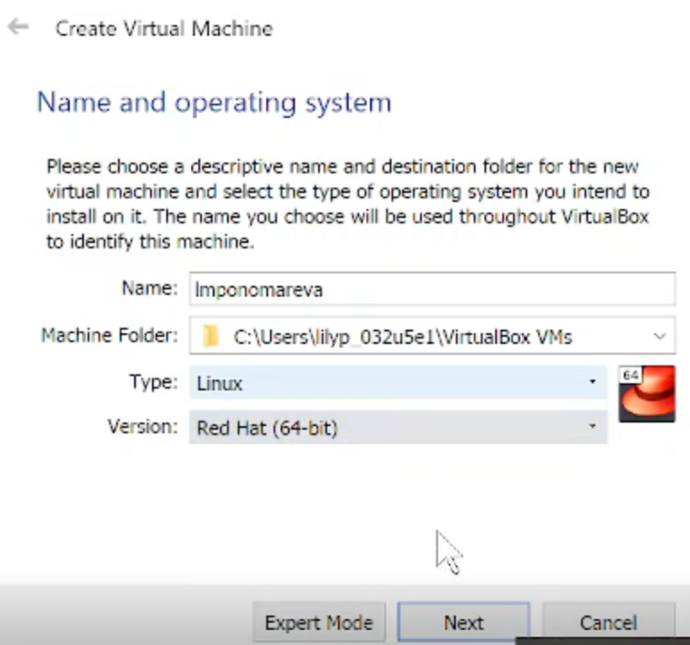{ #fig:001 width=70% }

# Задание размера основной памяти виртуальной машины

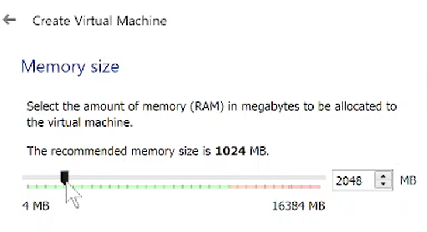{ #fig:002 width=70% }

# Задание конфигурации жёсткого диска

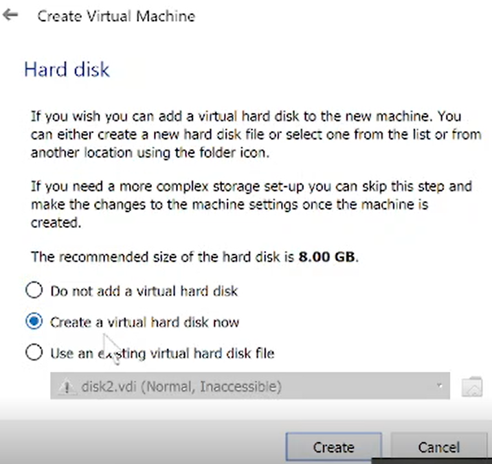{ #fig:003 width=70% }  

# Задание конфигурации жёсткого диска

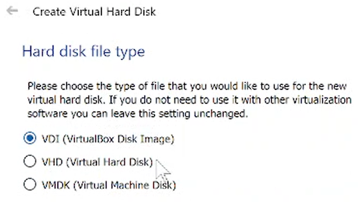{ #fig:004 width=70% }  

# Задание конфигурации жёсткого диска

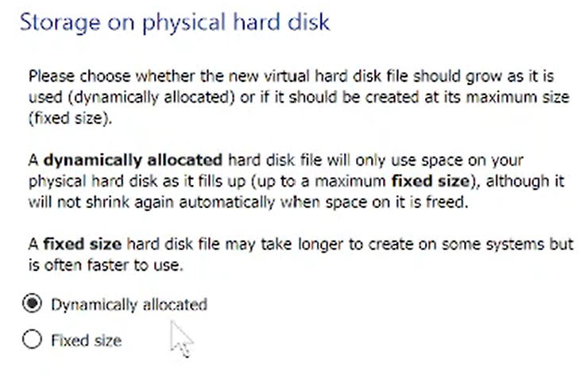{ #fig:005 width=70% }  

# Задание размера диска.

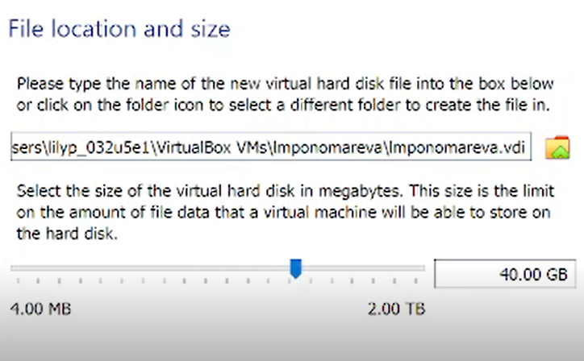{ #fig:006 width=70% }

# Добавление нового привода оптических дисков и выбор образа операционной системы

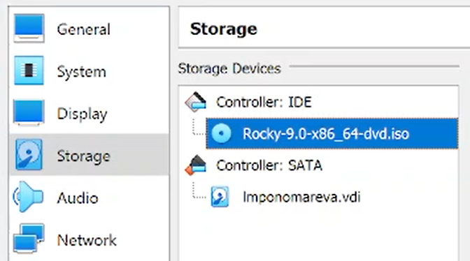{ #fig:007 width=70% }

# Запуск виртуальной машины

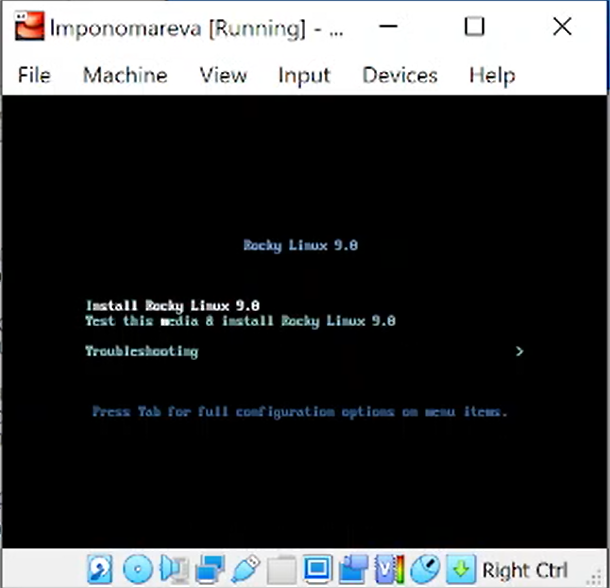{ #fig:008 width=70% }

# Выбор языка интерфейса

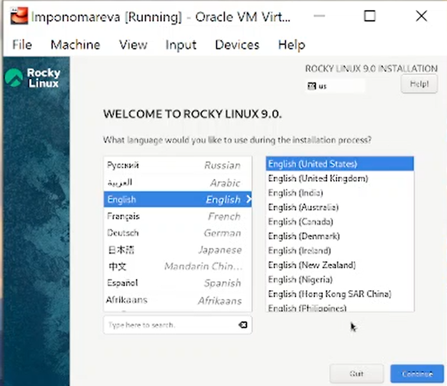{ #fig:009 width=70% }

# Настройки установки операционной системы

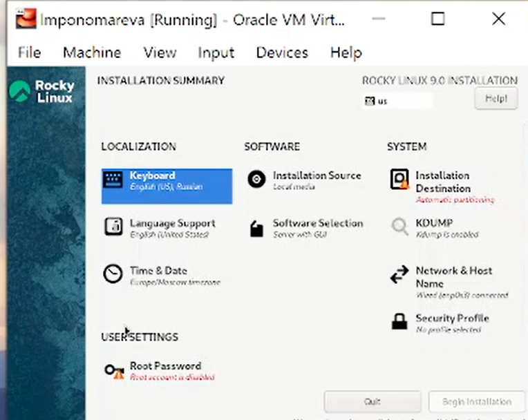{ #fig:010 width=70% }

# Задание базового окружения и дополнений

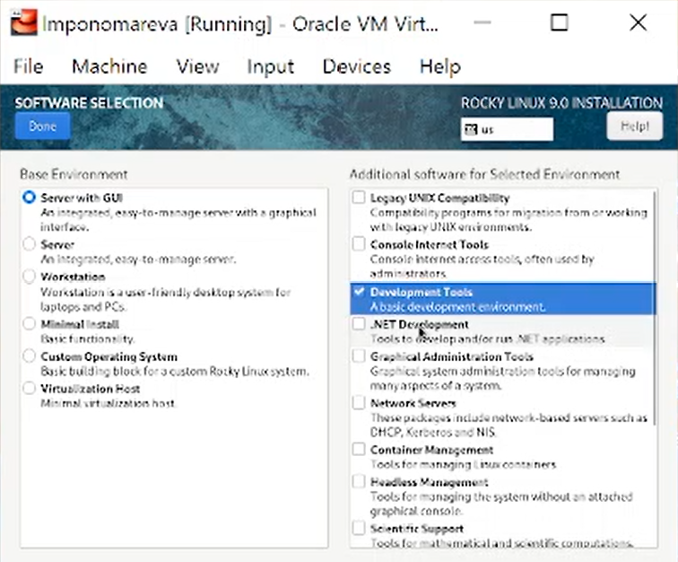{ #fig:011 width=70% }

# Отключение KDUMP

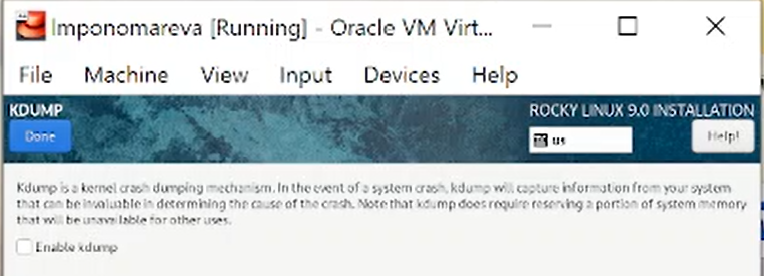{ #fig:012 width=70% }

# Место установки ОС

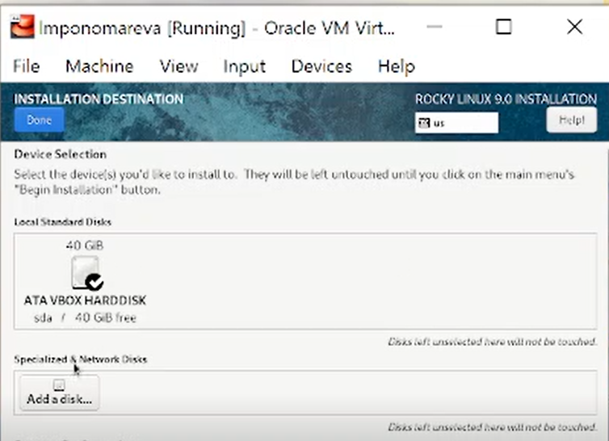{ #fig:013 width=70% }

# Включение сетевого соединения и задание имени узла

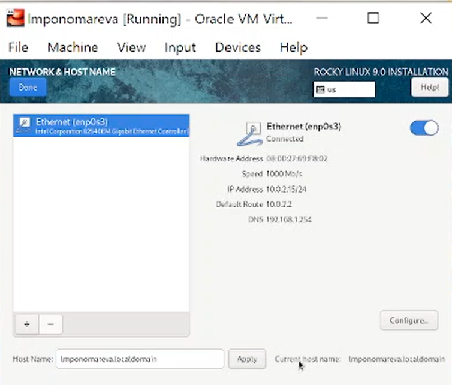{ #fig:014 width=70% }

# Установка пароля для root

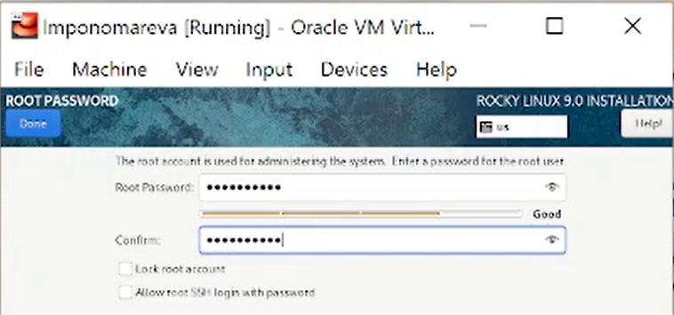{ #fig:015 width=70% }  

# Установка пароля для пользователя с правами администратора

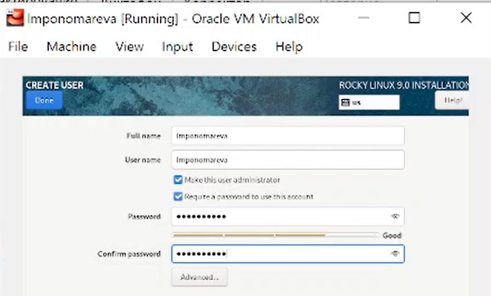{ #fig:016 width=70% }

# Перезапуск виртуальной машины  

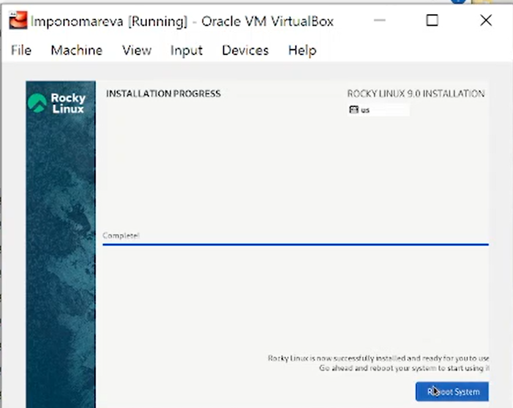{ #fig:017 width=70% }

# Подключение образа диска дополнений гостевой ОС

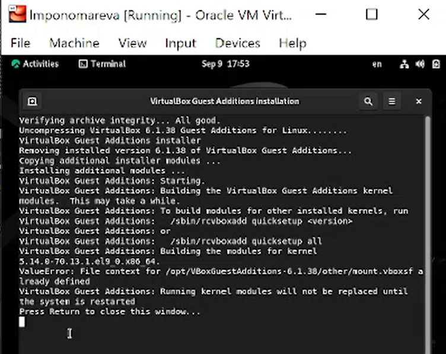{ #fig:018 width=70% }

# Домашнее задание
Дождитесь загрузки графического окружения и откройте терминал. В окне
терминала проанализируйте последовательность загрузки системы. 
Получите следующую информацию:

1. Версия ядра Linux (Linux version).
2. Частота процессора (Detected Mhz processor).
3. Модель процессора (CPU0).
4. Объем доступной оперативной памяти (Memory available).
5. Тип обнаруженного гипервизора (Hypervisor detected).
6. Тип файловой системы корневого раздела.
7. Последовательность монтирования файловых систем.

# Версия ядра Linux

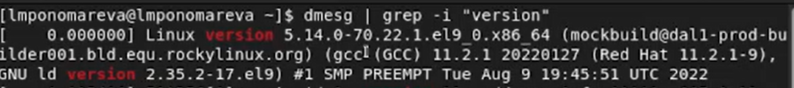{ #fig:019 width=70% }

# Частота процессора

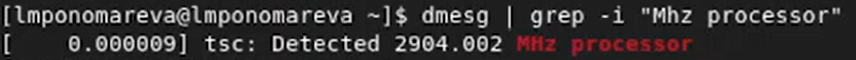{ #fig:020 width=70% }

# Модель процессора

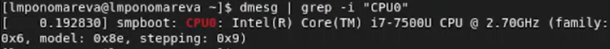{ #fig:021 width=70% }

# Объем доступной оперативной памяти

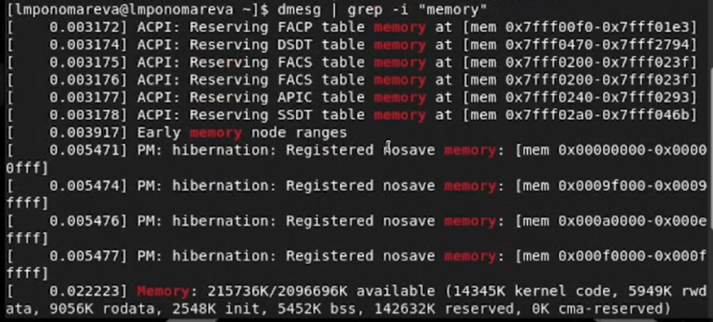{ #fig:022 width=70% }

# Тип обнаруженного гипервизора

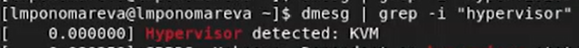{ #fig:023 width=70% }

# Тип файловой системы корневого раздела

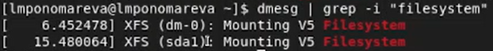{ #fig:024 width=70% }

# Последовательность монтирования файловых систем

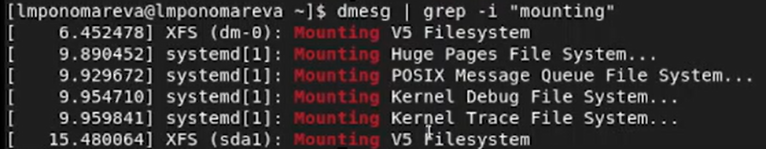{ #fig:025 width=70% }

# Вывод
Установили операционную систему Linux на виртуальную машину и настроили необходимые сервисы. 

# Список литературы {.unnumbered}
1. [Лабораторная работа № 1. Установка и конфигурация операционной системы на виртуальную машину](https://esystem.rudn.ru/pluginfile.php/1652016/mod_folder/content/0/001-lab_virtualbox.pdf?forcedownload=1)