---
## Front matter
title: "Лабораторная работа №1"
subtitle: "Установка и конфигурация операционной системы на виртуальную машину"
author: "Пономарева Лилия Михайловна"

## Generic otions
lang: ru-RU
toc-title: "Содержание"

## Bibliography
bibliography: bib/cite.bib
csl: pandoc/csl/gost-r-7-0-5-2008-numeric.csl

## Pdf output format
toc: true # Table of contents
toc-depth: 2
lof: true # List of figures
lot: false # List of tables
fontsize: 12pt
linestretch: 1.5
papersize: a4
documentclass: scrreprt
## I18n polyglossia
polyglossia-lang:
  name: russian
  options:
	- spelling=modern
	- babelshorthands=true
polyglossia-otherlangs:
  name: english
## I18n babel
babel-lang: russian
babel-otherlangs: english
## Fonts
mainfont: PT Serif
romanfont: PT Serif
sansfont: PT Sans
monofont: PT Mono
mainfontoptions: Ligatures=TeX
romanfontoptions: Ligatures=TeX
sansfontoptions: Ligatures=TeX,Scale=MatchLowercase
monofontoptions: Scale=MatchLowercase,Scale=0.9
## Biblatex
biblatex: true
biblio-style: "gost-numeric"
biblatexoptions:
  - parentracker=true
  - backend=biber
  - hyperref=auto
  - language=auto
  - autolang=other*
  - citestyle=gost-numeric
## Pandoc-crossref LaTeX customization
figureTitle: "Рис."
tableTitle: "Таблица"
listingTitle: "Листинг"
lofTitle: "Список иллюстраций"
lotTitle: "Список таблиц"
lolTitle: "Листинги"
## Misc options
indent: true
header-includes:
  - \usepackage{indentfirst}
  - \usepackage{float} # keep figures where there are in the text
  - \floatplacement{figure}{H} # keep figures where there are in the text
---

# Цель работы

Целью данной работы является приобретение практических навыков установки операционной системы на виртуальную машину, настройки минимально необходимых для дальнейшей работы сервисов.

# Выполнение лабораторной работы

Создала новую виртуальную машину.
Указала имя виртуальной машины (lmponomareva), тип
операционной системы — Linux, RedHat (рис. [-@fig:001]).

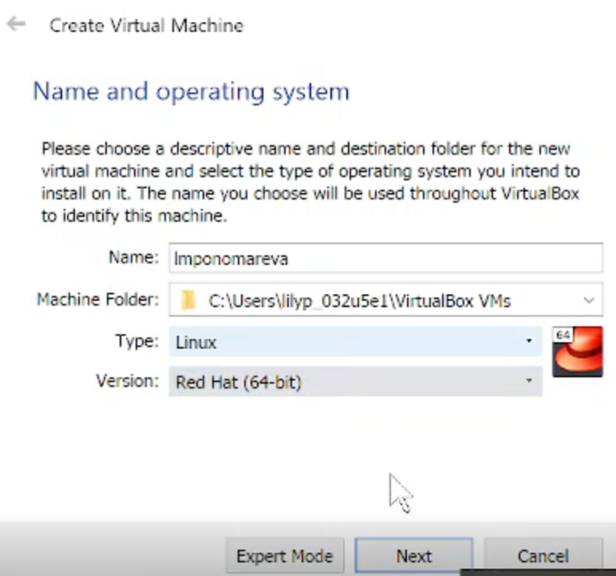{ #fig:001 width=70% }

Указала размер основной памяти виртуальной машины (рис. [-@fig:002]) — 2048 МБ.  

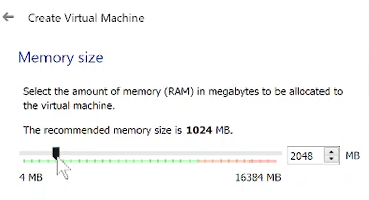{ #fig:002 width=70% }

Задала конфигурацию жёсткого диска — загрузочный, VDI (VirtualBox Disk
Image), динамический виртуальный диск (рис. [-@fig:003]-[-@fig:005]).

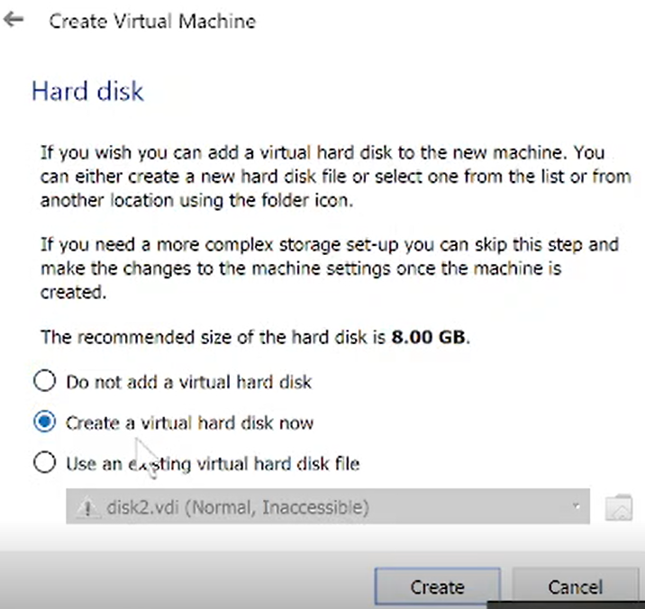{ #fig:003 width=70% }  

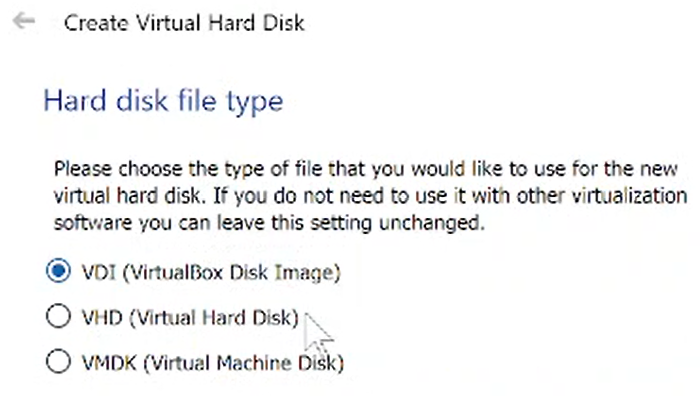{ #fig:004 width=70% }  

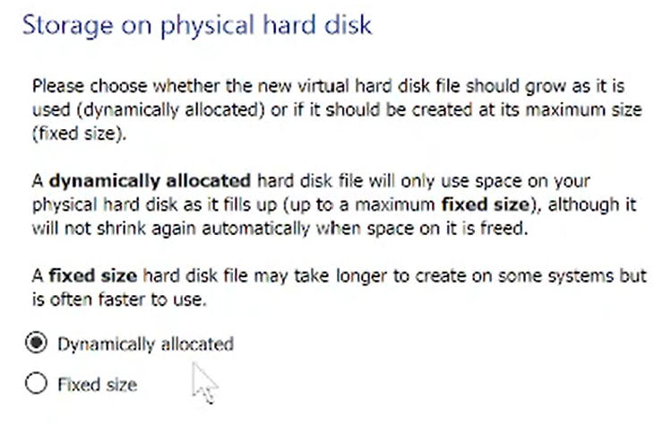{ #fig:005 width=70% }  

Задала размер диска — 40 ГБ (рис. [-@fig:006]).

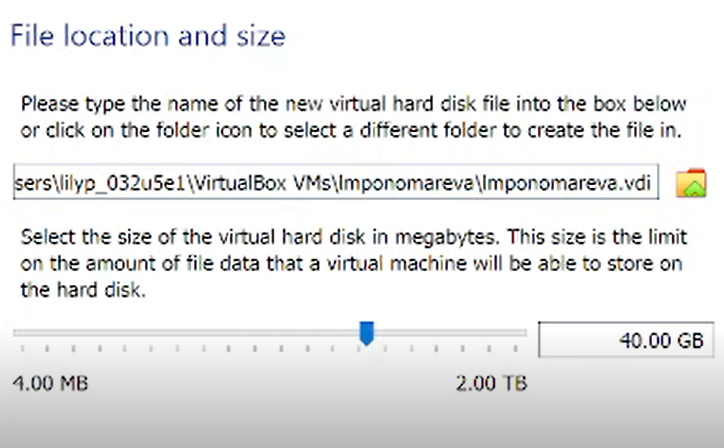{ #fig:006 width=70% }

Добавила новый привод оптических дисков и выбрала образ операционной системы Rocky-9.0-x86_64-dvd.iso
(рис. [-@fig:007])

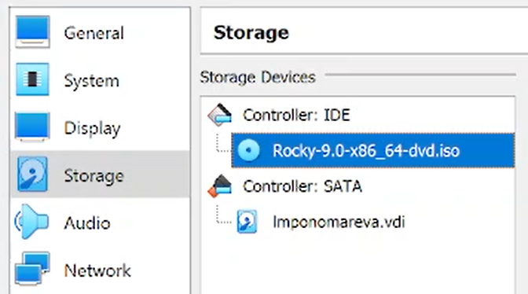{ #fig:007 width=70% }

Запустила виртуальную машину (рис. [-@fig:008])

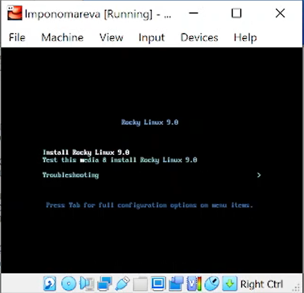{ #fig:008 width=70% }

Выбрала English в качестве языка интерфейса (рис. [-@fig:009])

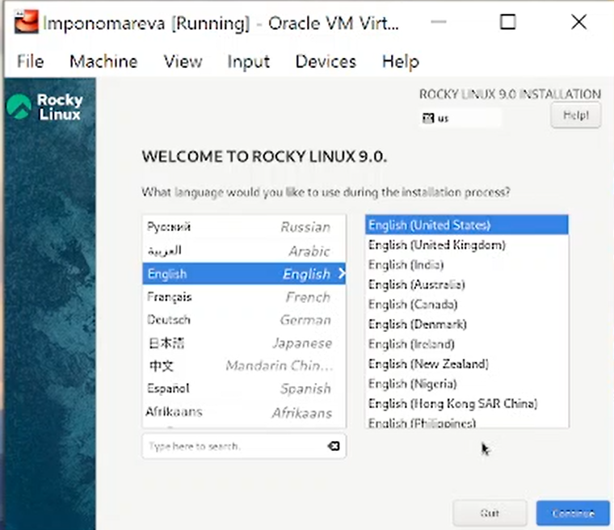{ #fig:009 width=70% }

Перешла к настройкам установки операционной системы (рис. [-@fig:010])

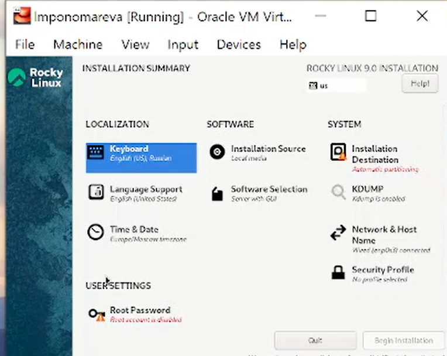{ #fig:010 width=70% }

Добавила в раскладку клавиатуры русский язык.  
В разделе выбора программ указала в качестве базового окружения Server with GUI, а в качестве дополнения — Development Tools (рис. [-@fig:011])

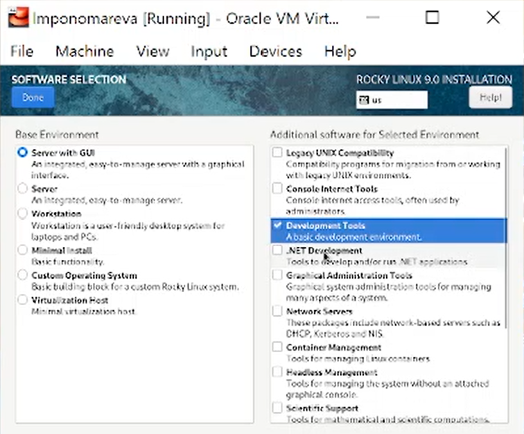{ #fig:011 width=70% }

Отключила KDUMP (рис. [-@fig:012])

{ #fig:012 width=70% }

Место установки ОС оставила без изменения (рис. [-@fig:013])

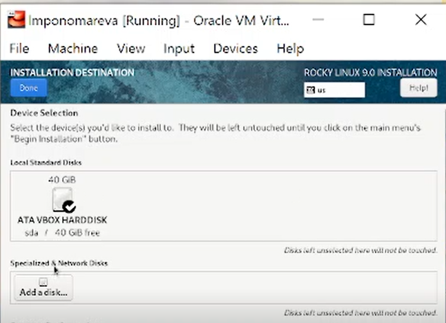{ #fig:013 width=70% }

Включила сетевое соединение и в качестве имени узла указала
lmponomareva.localdomain (рис. [-@fig:014]).

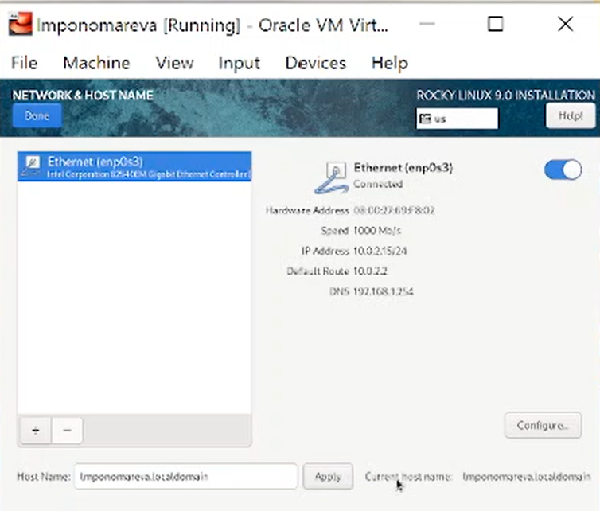{ #fig:014 width=70% }

Установила пароль для root и пользователя с правами администратора
(рис. [-@fig:015] и [-@fig:016])

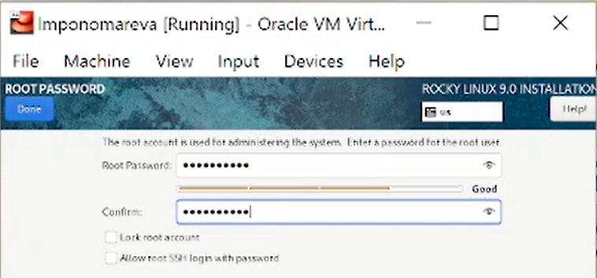{ #fig:015 width=70% }  

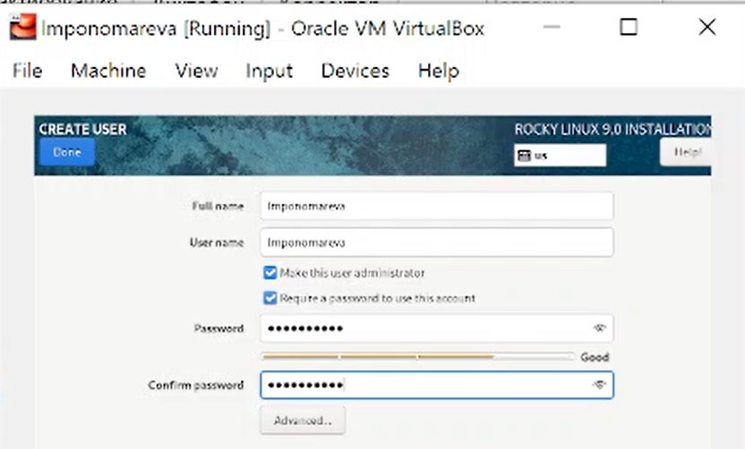{ #fig:016 width=70% }  

После завершения установки операционной системы корректно перезапустила виртуальную машину (рис. [-@fig:017]).

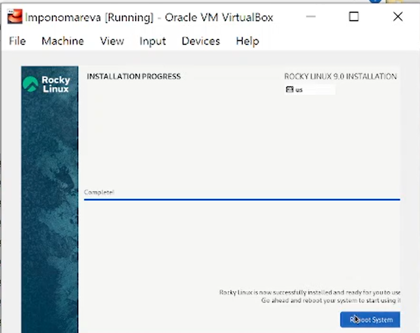{ #fig:017 width=70% }

Вошла в ОС под заданной при установке учётной записью. В меню Устройства виртуальной машины подключила образ диска дополнений гостевой ОС (рис. [-@fig:018])

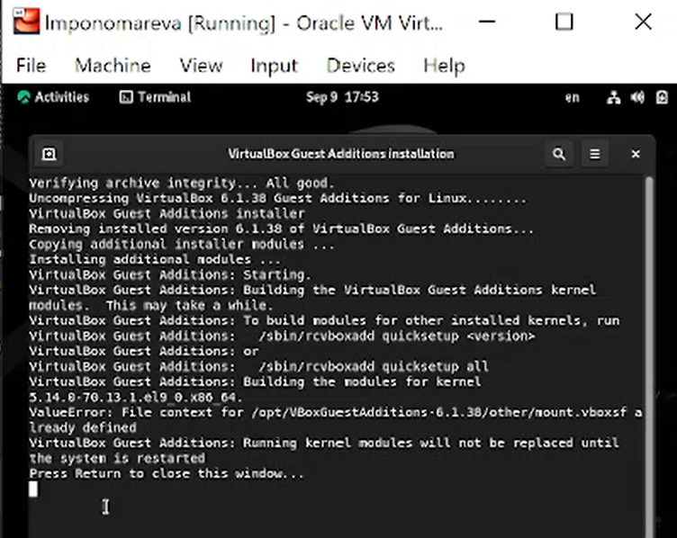{ #fig:018 width=70% }

# Домашнее задание
Дождитесь загрузки графического окружения и откройте терминал. В окне
терминала проанализируйте последовательность загрузки системы. 
Получите следующую информацию:

1. Версия ядра Linux (Linux version).
2. Частота процессора (Detected Mhz processor).
3. Модель процессора (CPU0).
4. Объем доступной оперативной памяти (Memory available).
5. Тип обнаруженного гипервизора (Hypervisor detected).
6. Тип файловой системы корневого раздела.
7. Последовательность монтирования файловых систем.

Версия ядра - 5.14.0(рис. [-@fig:019])  

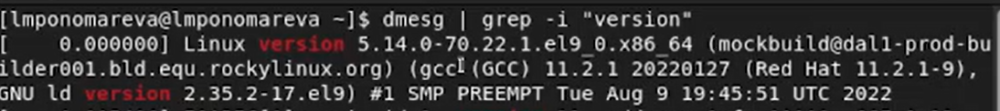{ #fig:019 width=70% }

Частота процессора - 2904.002 MHz(рис. [-@fig:020])  

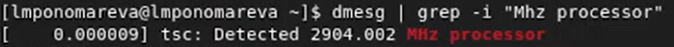{ #fig:020 width=70% }

Модель процессора - Intel Core i7(рис. [-@fig:021])  

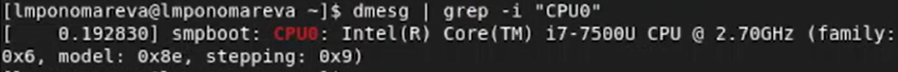{ #fig:021 width=70% }

Объем доступной оперативной памяти - 215736K(рис. [-@fig:022])  

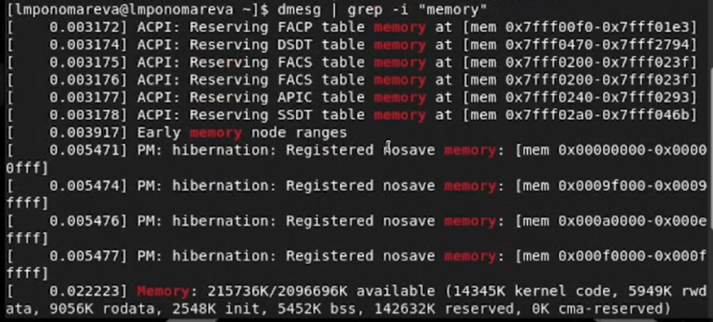{ #fig:022 width=70% }

Тип обнаруженного гипервизора - гипервизор KVM относиться к гипервизорам 2 типа, V (рис. [-@fig:023])  

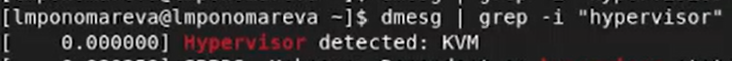{ #fig:023 width=70% }

Тип файловой системы корневого раздела - XFS (рис. [-@fig:024])  

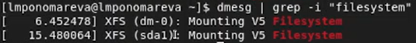{ #fig:024 width=70% }

Последовательность монтирования файловых систем (рис. [-@fig:025])  

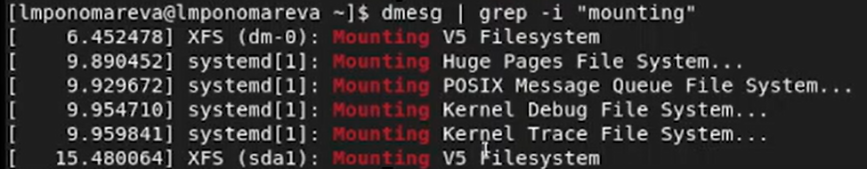{ #fig:025 width=70% }

# Выводы

Установили операционную систему Linux на виртуальную машину и настроили необходимые сервисы.

# Контрольные вопросы

1. Учётная запись, как правило, содержит сведения, необходимые для опознания пользователя при подключении к системе. Это идентификатор пользователя (login) и его пароль.
2. Команды терминала:
– для получения справки по команде – man; (man ls – выведет инфорацию о команде ls)
– для перемещения по файловой системе - cd; (cd ~  - переместит нас в домашний каталог)
– для просмотра содержимого каталога - ls; (введя ls в домашнем каталоге увидим все каталоги и файлы хранящиеся в ней)
– для определения объёма каталога – du (du ~  - увидим объем каждого файла в домашнем каталоге);
– для создания каталогов – mkdir <имя_каталога>
– для удаления каталогов – rmdir <имя_каталога>
– для создания файлов – touch <имя_файла>
– для удаления файлов – rm < имя_файла >
– для задания определённых прав на файл / каталог - опция --mode (или -m) присоздании каталога или команда chmod +x ;
– для просмотра истории команд – history.
3. Файловая система порядок, определяющий способ организации, хранения и именования данных на носителях информации. От нее зависит скорость работы с файлами, скорость записи, размер файлов и их сохранность. Примеры файловых систем:
1) Файловая система FAT(FileAllocationTable) поддерживается всеми ОС для ПК. Она проста, надежна и занимает мало места на диске.
2) Файловая система NTFS. Отличительные свойства данной файловой системы: поддержка больших файлов и дисков, низкий уровень фрагментации, поддержка длинных символьных имен, контроль доступа к каталогам и отдельным файлам. 
3) XFS – это высокопроизводительная файловая система. Преимущества: высокая скорость работы с большими файлами, отложенное выделение места, увеличение разделов на лету и незначительный размер служебной информации.
4) JFS или Journaled File System была разработана в IBM для AIX UNIX и использовалась в качестве альтернативы для файловых систем ext. Она используется там, где необходима высокая стабильность и минимальное потребление ресурсов.
4. Чтобы посмотреть, какие файловые системы подмонтированы в ОС можно ввести команду mount.
5. Чтобы удалить зависший процесс нужно сначала воспользоваться ps aux | grep ping, чтобы узнать идентификатор утилиты, которая зависла. Потом с помощью команды kill <идентификатор> удалить необходимый процесс.

# Список литературы{.unnumbered}

1. [Лабораторная работа № 1. Установка и конфигурация операционной системы на виртуальную машину](https://esystem.rudn.ru/pluginfile.php/1652016/mod_folder/content/0/001-lab_virtualbox.pdf?forcedownload=1)

::: {#refs}
:::
