---
## Front matter
lang: ru-RU
title: "Лабораторная работа №2"
subtitle: "Дискреционное разграничение прав в Linux. Основные атрибуты"
author:
    Лилия М. Пономарёва
    НПИбд-02-19\inst{1}
institute: |
	\inst{1}RUDN University, Moscow, Russian Federation
date: 2022, 19 March, Moscow, Russian Federation  

## Formatting
mainfont: PT Serif
romanfont: PT Serif
sansfont: PT Sans
monofont: PT Mono
toc: false
slide_level: 2
theme: metropolis
header-includes: 
 - \metroset{progressbar=frametitle,sectionpage=progressbar,numbering=fraction}
 - '\makeatletter'
 - '\beamer@ignorenonframefalse'
 - '\makeatother'
 - \usepackage[T2A]{fontenc}
 - \usepackage{amsmath}
aspectratio: 43
section-titles: true
---

# Цель работы
Получение практических навыков работы в консоли с атрибутами файлов, закрепление теоретических основ дискреционного разграничения доступа в современных системах с открытым кодом на базе ОС Linux[[1]](#список-литературы).

# Создали учётную запись пользователя guest

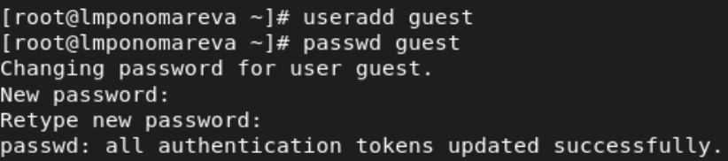{width=80% height=80% }

# Вход под созданным пользователем

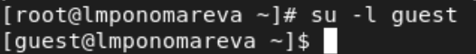{ #fig:002 width=80% height=80% }

# Определили директорию, в которой находимся

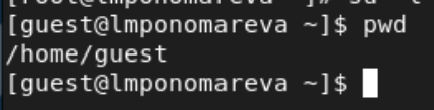{ #fig:003 width=80% height=80% }

# Команда whoami

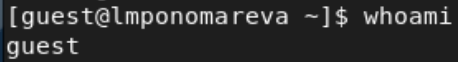{ #fig:004 width=80% height=80% }

# Команда id

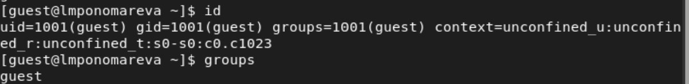{ #fig:005 width=80% height=80% }

# Просмотрели файл /etc/passwd командой cat

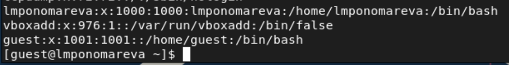{ #fig:006 width=80% height=80% }

# Определили существующие в системе директории

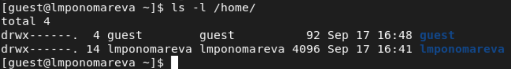{ #fig:007 width=80% height=80% }

# Посмотрели расширенные атрибуты установленые на поддиректориях

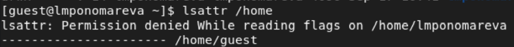{ #fig:008 width=80% height=80% }

# Создали в домашней директории поддиректорию dir1

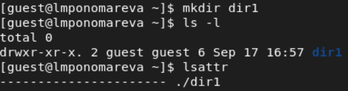{ #fig:009 width=80% height=80% }

# Команда chmod

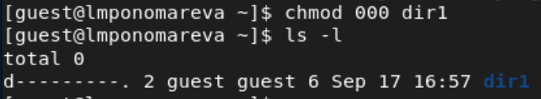{ #fig:010 width=80% height=80% }

# Попытались создать в директории файл

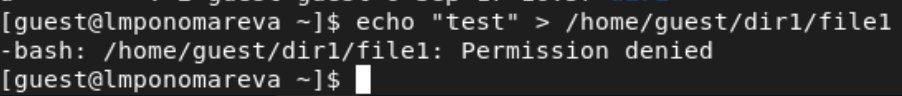{ #fig:011 width=80% height=80% }

# Команда ls -l

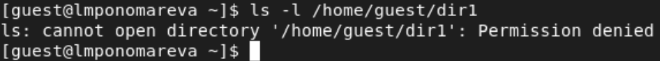{ #fig:012 width=80% height=80% }

# Установленные права и разрешённые действия

: Установленные права и разрешённые действия

|Права д|Права ф|Создание ф|Удаление ф|Запись в ф|Чтение из ф|Смена д|Просмотр ф в д|Переименование ф|Смена атр ф|
|   :---:  |   :---:  |:---:|:---:|:---:|:---:|:---:|:---:|:---:|:---:|
|```d---```|```----```| - | - | - | - | - | - | - | - |
|```d--x```|```----```| - | - | - | - | + | - | - | + |
|```d-w-```|```----```| - | - | - | - | - | - | - | - |
|```d-wx```|```----```| + | + | - | - | + | - | + | + |

# Минимальные права для совершения операций

: Минимальные права для совершения операций

|Операция	       |Права на директорию |Права на файл|
|:--------------------:|:------------------:|:-----------:|
|Создание файла        |```d-wx```|```---```  |	    
|Удаление файла        |```d-wx```|```---```  |
|Чтение файла	       |```d--x```|```r--```  |
|Запись в файл	       |```d--x```|  ```-w-```  |
|Переименование файла  |```d-wx```|  ```---```  |
|Создание поддиректории|```d-wx```|  ```---```  |
|Удаление поддиректории|```d-wx```|  ```---```  |

# Вывод
Научились работать в консоли с атрибутами файлов, закрепили теоретические основы дискреционного разграничения доступа в современных системах с открытым кодом на базе ОС Linux.

# Список литературы {.unnumbered}

1. [Основы безопасности информационных систем : Учеб. пособие для студентов вузов, обучающихся по специальностям "Компьютер. безопасность" и "Комплекс. обеспечение информ. безопасности автоматизир. систем" / Д.А. Зегжда, А.М. Ивашко. - М. : Горячая линия - Телеком, 2000. - 449, [2] с. : ил., табл.; 21 см.; ISBN 5-93517-018-3](https://search.rsl.ru/ru/record/01000682756).