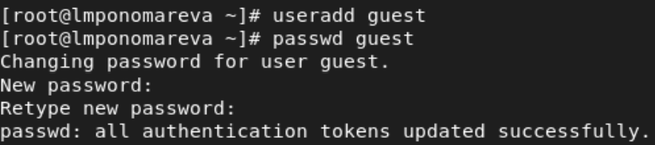
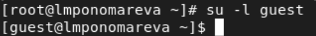
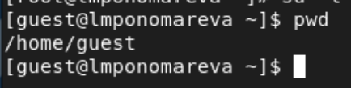
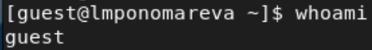
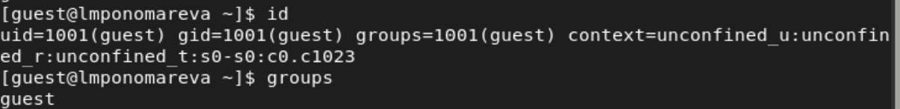
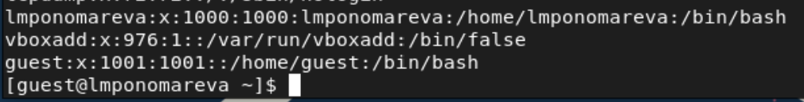
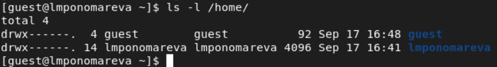
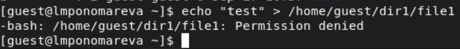

---
## Front matter
title: "Лабораторная работа №2"
subtitle: "Дискреционное разграничение прав в Linux. Основные атрибуты"
author: "Пономарева Лилия Михайловна"

## Generic options
lang: ru-RU
toc-title: "Содержание"

## Bibliography
bibliography: bib/cite.bib
csl: pandoc/csl/gost-r-7-0-5-2008-numeric.csl

## Pdf output format
toc: true # Table of contents
toc-depth: 2
lof: true # List of figures
lot: true # List of tables
fontsize: 12pt
linestretch: 1.5
papersize: a4
documentclass: scrreprt
## I18n polyglossia
polyglossia-lang:
  name: russian
  options:
	- spelling=modern
	- babelshorthands=true
polyglossia-otherlangs:
  name: english
## I18n babel
babel-lang: russian
babel-otherlangs: english
## Fonts
mainfont: PT Serif
romanfont: PT Serif
sansfont: PT Sans
monofont: PT Mono
mainfontoptions: Ligatures=TeX
romanfontoptions: Ligatures=TeX
sansfontoptions: Ligatures=TeX,Scale=MatchLowercase
monofontoptions: Scale=MatchLowercase,Scale=0.9
## Biblatex
biblatex: true
biblio-style: "gost-numeric"
biblatexoptions:
  - parentracker=true
  - backend=biber
  - hyperref=auto
  - language=auto
  - autolang=other*
  - citestyle=gost-numeric
## Pandoc-crossref LaTeX customization
figureTitle: "Рис."
tableTitle: "Таблица"
listingTitle: "Листинг"
lofTitle: "Список иллюстраций"
lotTitle: "Список таблиц"
lolTitle: "Листинги"
## Misc options
indent: true
header-includes:
  - \usepackage{indentfirst}
  - \usepackage{float} # keep figures where there are in the text
  - \floatplacement{figure}{H} # keep figures where there are in the text
---

# Цель работы

Получение практических навыков работы в консоли с атрибутами файлов, закрепление теоретических основ дискреционного разграничения доступа в современных системах с открытым кодом на базе ОС Linux[[1]](#список-литературы).

# Теоретическое введение

В Linux, как и в любой многопользовательской системе, абсолютно естественным образом возникает задача разграничения доступа субъектов — пользователей к объектам — файлам дерева каталогов.  

Один из подходов к разграничению доступа — так называемый дискреционный — предполагает назначение владельцев объектов, которые по собственному усмотрению определяют права доступа субъектов к объектам, которыми владеют.  

Дискреционные механизмы разграничения доступа используются для разграничения прав доступа процессов как обычных пользователей, так и для ограничения прав системных программ, которые работают от лица псевдопользовательских учетных записей.  

В рамках дискреционного разграничения доступа каждому файлу назначен пользователь-владелец и группа-владелец файла.  

В метаданных каждого объекта содержится список разрешений на доступ к нему для разных категорий субъектов.

Атрибуты Minimal ACL поддерживают три базовых класса субъектов доступа к файлу (класс All объединяет все три класса):

User access (u) – доступ для владельца файла;  
Group access (g) – доступ для группы, владеющей файлом;  
Other access (o) – доступ для остальных пользователей (кроме пользователя root);   
All access (a) – доступ для всех субъектов доступа (u, g, o).  

Для каждого из этих классов определены три типа разрешений:  
На чтение содержимого файла (read) – символ «r».  
На запись внутри файла или изменения его содержимого (write) – символ «w».  
На исполнение файла (если это бинарный исполняемый файл или  файл сценария интерпретатора (execute)) – символ «x».  

Для директорий трактовка типов разрешений иная:  
r – разрешение на «открытие» директории, то есть на чтение списка файлов, которые содержит эта директория.  
w – разрешение на модификацию этого списка файлов (создание/удаление/переименование/перемещение) файлов этой директории.  
x – разрешение на «исполнение» директории, то есть на возможность перейти в нее.  

Чтобы изменить расширения для определенного файла используется команда chmod с соответствующими аргументами.

# Выполнение лабораторной работы

1. Создала учётную запись пользователя guest (использую учётную запись администратора):
useradd guest. Задала пароль для пользователя guest (использую учётную запись администратора): passwd guest (рис. -@fig:001)

{ #fig:001 width=80% height=80% }

2. Вошла в систему от имени пользователя guest (рис. -@fig:002)

{ #fig:002 width=80% height=80% }

3. Определила директорию, в которой нахожусь, командой pwd (рис. -@fig:003)

{ #fig:003 width=80% height=80% }

Директория /home/имя_пользователя является домашней директорией, в нашем случае это директория home/guest.

4. Уточнила имя пользователя командой whoami. (рис. -@fig:004)

{ #fig:004 width=80% height=80% }

5. Уточнила имя пользователя, его группу, а также группы, куда входит пользователь, командой id (рис. -@fig:005)

{ #fig:005 width=80% height=80% }

Сравним вывод id с выводом команды groups: id вывело номер группы 1001 и её название guest, groups также вывело название guest.

6. Просмотрела файл /etc/passwd командой cat /etc/passwd. Нашла в нём свою учётную запись (рис. -@fig:006)

{ #fig:006 width=80% height=80% }

uid = 1001
gid = 1001

7. Определила существующие в системе директории командой ls -l /home/ (рис. -@fig:007)

{ #fig:007 width=80% height=80% }

Получили список поддиректорий, в нем директории двух пользователей: lmponomareva и guest, с правами на чтение, запись и переход в директорию для владельца.

8. Проверила, какие расширенные атрибуты установлены на поддиректориях, находящихся в директории /home, командой: lsattr /home (рис. -@fig:008)

{ #fig:008 width=80% height=80% }

Можно видеть расширенные атрибуты своей директории, но нельзя увидеть атрибуты других.

9. Создала в домашней директории поддиректорию dir1 командой mkdir dir1 (рис. -@fig:009)

{ #fig:009 width=80% height=80% }

Определила командами ls -l и lsattr, какие права доступа и расширенные атрибуты были выставлены на директорию dir1: все права для владельца, право на чтение и вход для группы и остальных.

12. Сняла с директории dir1 все атрибуты командой chmod 000 dir1 и проверила с её помощью правильность выполнения команды ls -l (рис. -@fig:010)

{ #fig:010 width=80% height=80% }

13. Попыталась создать в директории dir1 файл file1 командой echo "test" > /home/guest/dir1/file1. (рис. -@fig:011)

{ #fig:011 width=80% height=80% }

Так как мы закрыли владельцу доступ на запись в директорию, мы не смогли создать файл.

Попробовала командой ls -l /home/guest/dir1 проверить действительно ли файл file1 не находится внутри директории dir1 (рис. -@fig:012)

{ #fig:012 width=80% height=80% }

14. Заполнила таблицу «Установленные права и разрешённые действия» (табл. 1), выполняя действия от имени владельца директории (файлов), определив опытным путём, какие операции разрешены, а какие нет.
Если операция разрешена, заносила в таблицу знак «+», если не разрешена, знак «-».

: Установленные права и разрешённые действия

|Права директории|Права файла|Создание файла|Удаление файла|Запись в файл|Чтение из файла|Смена директории|Просмотр файлов в директории|Переименование файла|Смена атрибутов файла|
|   :---:  |   :---:  |:---:|:---:|:---:|:---:|:---:|:---:|:---:|:---:|
|```d---```|```----```| - | - | - | - | - | - | - | - |
|```d--x```|```----```| - | - | - | - | + | - | - | + |
|```d-w-```|```----```| - | - | - | - | - | - | - | - |
|```d-wx```|```----```| + | + | - | - | + | - | + | + |
|```dr--```|```----```| - | - | - | - | - | - | - | - |
|```dr-x```|```----```| - | - | - | - | + | + | - | + |
|```drw-```|```----```| - | - | - | - | - | - | - | - |
|```drwx```|```----```| + | + | - | - | + | + | + | + |
|```d---```|```---x```| - | - | - | - | - | - | - | - |
|```d--x```|```---x```| - | - | - | - | + | - | - | + |
|```d-w-```|```---x```| - | - | - | - | - | - | - | - |
|```d-wx```|```---x```| + | + | - | - | + | - | + | + |
|```dr--```|```---x```| - | - | - | - | - | - | - | - |
|```dr-x```|```---x```| - | - | - | - | + | + | - | + |
|```drw-```|```---x```| - | - | - | - | - | - | - | - |
|```drwx```|```---x```| + | + | - | - | + | + | + | + |
|```d---```|```--w-```| - | - | - | - | - | - | - | - |
|```d--x```|```--w-```| - | - | + | - | + | - | - | + |
|```d-w-```|```--w-```| - | - | - | - | - | - | - | - |
|```d-wx```|```--w-```| + | + | + | - | + | - | + | + |
|```dr--```|```--w-```| - | - | - | - | - | - | - | - |
|```dr-x```|```--w-```| - | - | + | - | + | + | - | + |
|```drw-```|```--w-```| - | - | - | - | - | - | - | - |
|```drwx```|```--w-```| + | + | + | - | + | + | + | + |
|```d---```|```--wx```| - | - | - | - | - | - | - | - |
|```d--x```|```--wx```| - | - | + | - | + | - | - | + |
|```d-w-```|```--wx```| - | - | - | - | - | - | - | - |
|```d-wx```|```--wx```| + | + | + | - | + | - | + | + |
|```dr--```|```--wx```| - | - | - | - | - | - | - | - |
|```dr-x```|```--wx```| - | - | + | - | + | + | - | + |
|```drw-```|```--wx```| - | - | - | - | - | - | - | - |
|```drwx```|```--wx```| + | + | + | - | + | + | + | + |
|```d---```|```-r--```| - | - | - | - | - | - | - | - |
|```d--x```|```-r--```| - | - | - | + | + | - | - | + |
|```d-w-```|```-r--```| - | - | - | - | - | - | - | - |
|```d-wx```|```-r--```| + | + | - | + | + | - | + | + |
|```dr--```|```-r--```| - | - | - | - | - | - | - | - |
|```dr-x```|```-r--```| - | - | - | + | + | + | - | + |
|```drw-```|```-r--```| - | - | - | - | - | - | - | - |
|```drwx```|```-r--```| + | + | - | + | + | + | + | + |
|```d---```|```-r-x```| - | - | - | - | - | - | - | - |
|```d--x```|```-r-x```| - | - | - | + | + | - | - | + |
|```d-w-```|```-r-x```| - | - | - | - | - | - | - | - |
|```d-wx```|```-r-x```| + | + | - | + | + | - | + | + |
|```dr--```|```-r-x```| - | - | - | - | - | - | - | - |
|```dr-x```|```-r-x```| - | - | - | + | + | + | - | + |
|```drw-```|```-r-x```| - | - | - | - | - | - | - | - |
|```drwx```|```-r-x```| + | + | - | + | + | + | + | + |
|```d---```|```-rw-```| - | - | - | - | - | - | - | - |
|```d--x```|```-rw-```| - | - | + | + | + | - | - | + |
|```d-w-```|```-rw-```| - | - | - | - | - | - | - | - |
|```d-wx```|```-rw-```| + | + | + | + | + | - | + | + |
|```dr--```|```-rw-```| - | - | - | - | - | - | - | - |
|```dr-x```|```-rw-```| - | - | + | + | + | + | - | + |
|```drw-```|```-rw-```| - | - | - | - | - | - | - | - |
|```drwx```|```-rw-```| + | + | + | + | + | + | + | + |
|```d---```|```-rwx```| - | - | - | - | - | - | - | - |
|```d--x```|```-rwx```| - | - | + | + | + | - | - | + |
|```d-w-```|```-rwx```| - | - | - | - | - | - | - | - |
|```d-wx```|```-rwx```| + | + | + | + | + | - | + | + |
|```dr--```|```-rwx```| - | - | - | - | - | - | - | - |
|```dr-x```|```-rwx```| - | - | + | + | + | + | - | + |
|```drw-```|```-rwx```| - | - | - | - | - | - | - | - |
|```drwx```|```-rwx```| + | + | + | + | + | + | + | + |

15. На основании заполненоной таблицы определила те или иные минимально необходимые права для выполнения операций внутри директории dir1, заполнила табл. 2

: Минимальные права для совершения операций

|Операция	       |Права на директорию |Права на файл|
|:--------------------:|:------------------:|:-----------:|
|Создание файла        |```d-wx```|```---```  |	    
|Удаление файла        |```d-wx```|```---```  |
|Чтение файла	       |```d--x```|```r--```  |
|Запись в файл	       |```d--x```|  ```-w-```  |
|Переименование файла  |```d-wx```|  ```---```  |
|Создание поддиректории|```d-wx```|  ```---```  |
|Удаление поддиректории|```d-wx```|  ```---```  |

# Выводы

Научились работать в консоли с атрибутами файлов, закрепили теоретические основы дискреционного разграничения доступа в современных системах с открытым кодом на базе ОС Linux.

# Список литературы{.unnumbered}

1. [Основы безопасности информационных систем : Учеб. пособие для студентов вузов, обучающихся по специальностям "Компьютер. безопасность" и "Комплекс. обеспечение информ. безопасности автоматизир. систем" / Д.А. Зегжда, А.М. Ивашко. - М. : Горячая линия - Телеком, 2000. - 449, [2] с. : ил., табл.; 21 см.; ISBN 5-93517-018-3](https://search.rsl.ru/ru/record/01000682756).

::: {#refs}
:::
