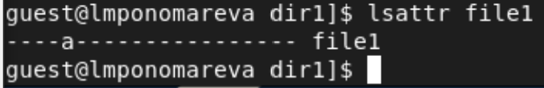
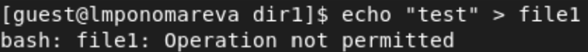

---
## Front matter
lang: ru-RU
title: "Лабораторная работа №4"
subtitle: "Дискреционное разграничение прав в Linux. Расширенные атрибуты"
author:
    Лилия М. Пономарёва
    НПИбд-02-19\inst{1}
institute: |
	\inst{1}RUDN University, Moscow, Russian Federation
date: 2022, 19 March, Moscow, Russian Federation  

## Formatting
mainfont: PT Serif
romanfont: PT Serif
sansfont: PT Sans
monofont: PT Mono
toc: false
slide_level: 2
theme: metropolis
header-includes: 
 - \metroset{progressbar=frametitle,sectionpage=progressbar,numbering=fraction}
 - '\makeatletter'
 - '\beamer@ignorenonframefalse'
 - '\makeatother'
 - \usepackage[T2A]{fontenc}
 - \usepackage{amsmath}
aspectratio: 43
section-titles: true
---

# Цель работы

Получение практических навыков работы в консоли с расширенными
атрибутами файлов.

# Определила расширенные атрибуты файла file1

{ #fig:001 width=80% height=80% }

# Установила на файл file1 права, разрешающие чтение и запись

{ #fig:001 width=80% height=80% }

# Попробовала установить на файл /home/guest/dir1/file1 расширенный атрибут a

{ #fig:001 width=80% height=80% }

# Попробовала установить расширенный атрибут a на файл от имени суперпользователя

{ #fig:001 width=80% height=80% }

# От пользователя guest проверила правильность установления атрибута

{ #fig:001 width=80% height=80% }

# Выполнила дозапись в файл file1

{ #fig:001 width=80% height=80% }

# Попробовала удалить файл

{ #fig:001 width=80% height=80% }

# Попробовала перезаписать файл

{ #fig:001 width=80% height=80% }

# Попробовала переименовать файл

{ #fig:001 width=80% height=80% }

# Попробовала установить на файл права, запрещающие чтение и запись

{ #fig:001 width=80% height=80% }

# Сняла расширенный атрибут a с файла

{ #fig:001 width=80% height=80% }

# Повторила операции, которые ранее не удавалось выполнить

{ #fig:001 width=80% height=80% }

# Заменила атрибут «a» атрибутом «i»

{ #fig:001 width=80% height=80% }

# Повторила выполнение операций

{ #fig:001 width=80% height=80% }

# Вывод

Опробовали на практике действие расширенных атрибутов «а» и «i».

