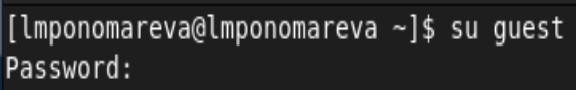
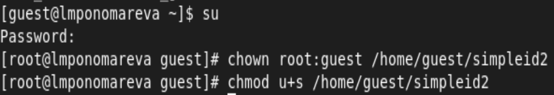
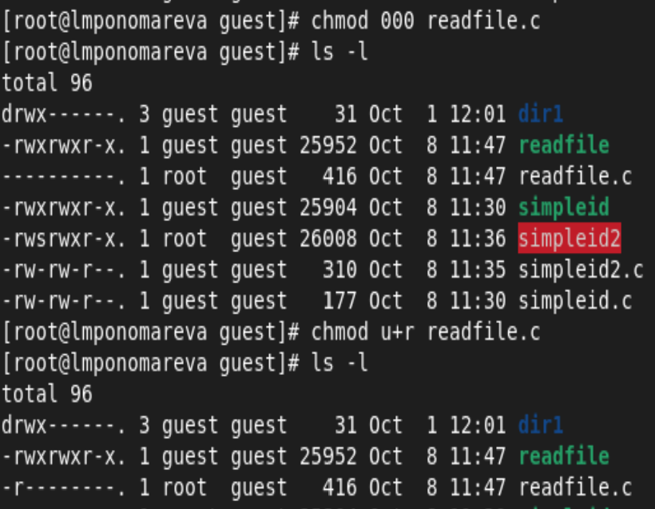
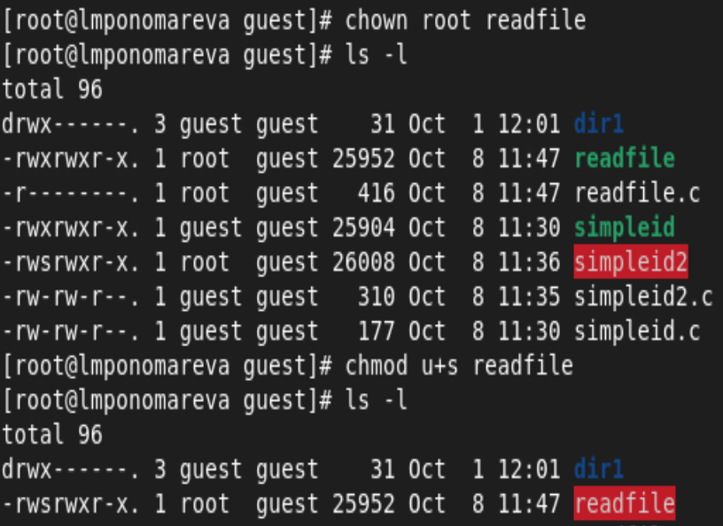
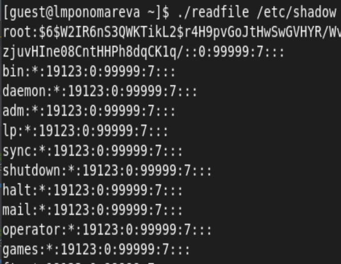
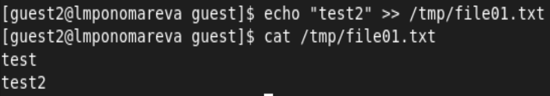
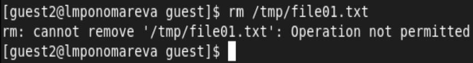
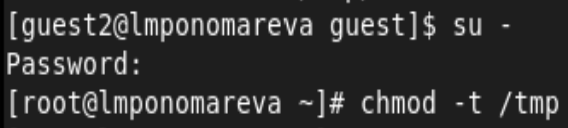
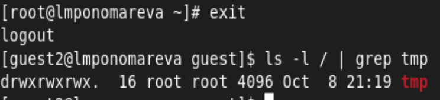
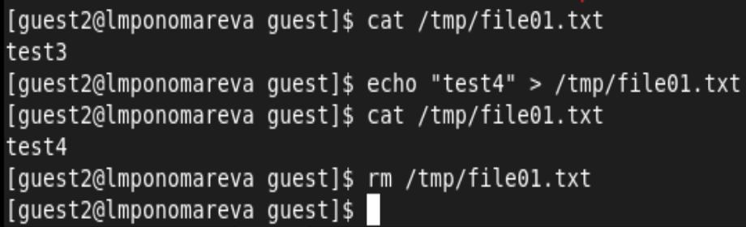

---
## Front matter
title: "Лабораторная работа №5"
subtitle: "Дискреционное разграничение прав в Linux. Исследование влияния дополнительных атрибутов."
author: "Пономарева Лилия Михайловна"

## Generic options
lang: ru-RU
toc-title: "Содержание"

## Bibliography
bibliography: bib/cite.bib
csl: pandoc/csl/gost-r-7-0-5-2008-numeric.csl

## Pdf output format
toc: true # Table of contents
toc-depth: 2
lof: true # List of figures
lot: false # List of tables
fontsize: 12pt
linestretch: 1.5
papersize: a4
documentclass: scrreprt
## I18n polyglossia
polyglossia-lang:
  name: russian
  options:
	- spelling=modern
	- babelshorthands=true
polyglossia-otherlangs:
  name: english
## I18n babel
babel-lang: russian
babel-otherlangs: english
## Fonts
mainfont: PT Serif
romanfont: PT Serif
sansfont: PT Sans
monofont: PT Mono
mainfontoptions: Ligatures=TeX
romanfontoptions: Ligatures=TeX
sansfontoptions: Ligatures=TeX,Scale=MatchLowercase
monofontoptions: Scale=MatchLowercase,Scale=0.9
## Biblatex
biblatex: true
biblio-style: "gost-numeric"
biblatexoptions:
  - parentracker=true
  - backend=biber
  - hyperref=auto
  - language=auto
  - autolang=other*
  - citestyle=gost-numeric
## Pandoc-crossref LaTeX customization
figureTitle: "Рис."
tableTitle: "Таблица"
listingTitle: "Листинг"
lofTitle: "Список иллюстраций"
lotTitle: "Список таблиц"
lolTitle: "Листинги"
## Misc options
indent: true
header-includes:
  - \usepackage{indentfirst}
  - \usepackage{float} # keep figures where there are in the text
  - \floatplacement{figure}{H} # keep figures where there are in the text
---

# Цель работы

Изучение механизмов изменения идентификаторов, применения SetUID- и Sticky-битов. Получение практических навыков работы в консоли с дополнительными атрибутами. Рассмотрение работы механизма смены идентификатора процессов пользователей, а также влияние бита Sticky на запись и удаление файлов [[1]](#список-литературы).

# Теоретическое введение

Биты SUID, SGID и Sticky.  
Unix отслеживает не символьные имена владельцев и групп, а их идентификаторы (UID - для пользователей и GID для групп). Эти идентификаторы хранятся в файлах /etc/passwd и /etc/group соответственно. Символьные эквиваленты идентификаторов используются только для удобства, например, при использовании команды ls, идентификаторы заменяются соответствующими символьными обозначениями.  
Что касается процессов, то с ними связано не два идентификатора, а 4-е: реальный и эффективный пользовательский (UID), а также реальный и эффективный групповой (GID). Реальные номера применяются для учета использования системных ресурсов, а эффективные для определения прав доступа к процессам. Как правило, реальные и эффективные идентификаторы совпадают. Владелец процесса может посылать ему сигналы, а также изменять приоритет.  
Процесс не может явно изменить ни одного из своих четырех идентификаторов, но есть ситуации когда происходит косвенная установка новых эффективных идентификаторов процесса. Дело в том, что существуют два специальных бита: SUID (Set User ID - бит смены идентификатора пользователя) и SGID (Set Group ID - бит смены идентификатора группы). Когда пользователь или процесс запускает исполняемый файл с установленным одним из этих битов, файлу временно назначаются права его (файла) владельца или группы (в зависимости от того, какой бит задан). Таким образом, пользователь может даже запускать файлы от имени суперпользователя.  
Вобщем, одним словом установка битов SUID или SGID позволит пользователям запускать исполняемые файлы от имени владельца (или группы) запускаемого файла. Например, как говорилось выше, команду chmod по умолчанию может запускать только root. Если мы установим SUID на исполняемый файл /bin/chmod, то обычный пользователь сможет использовать эту команду без использования sudo, так, что она будет выполнятся от имени пользователя root. В некоторых случаях очень удобное решение. Кстати по такому принципу работает команда passwd, c помощью которой пользователь может изменить свой пароль.  
Еще одно важное усовершенствование касается использования sticky-бита в каталогах. Каталог с установленным sticky-битом означает, что удалить файл из этого каталога может только владелец файла или суперпользователь. Другие пользователи лишаются права удалять файлы. Установить sticky-бит в каталоге может только суперпользователь. Sticky-бит каталога, в отличие от sticky-бита файла, остается в каталоге до тех пор, пока владелец каталога или суперпользователь не удалит каталог явно или не применит к нему chmod. Заметьте, что владелец может удалить sticky-бит, но не может его установить.

# Выполнение лабораторной работы

1. Вошла в систему от имени пользователя guest([рис. 1](../../image/1.png)).

{ #fig:001 width=80% height=80% }

2. Создала программу simpleid.c ([рис. 2](../../image/2.png)).

{ #fig:001 width=80% height=80% }

3. Скомплилировала программу simpleid, выполнила её и сравнила результат с выводом команды id ([рис. 3](../../image/3.png)).

{ #fig:001 width=80% height=80% }

Видим совпадение id пользователя и группы.

4. Усложнила программу, добавив вывод действительных идентификаторов ([рис. 4](../../image/4.png)).

{ #fig:001 width=80% height=80% }

5. Скомпилировала и запустила программу simpleid2.c ([рис. 5](../../image/5.png)).

{ #fig:001 width=80% height=80% }

6. От имени суперпользователя выполнила команды смены владельца и группы файла simpleid2 и его прав доступа ([рис. 6](../../image/6.png)).

{ #fig:001 width=80% height=80% }

7. Проверила правильность установки новых атрибутов и смены владельца файла simpleid2, запустила программу и сравнила её вывод с результатом ввода команды id: ([рис. 7](../../image/7.png)).

{ #fig:001 width=80% height=80% }

Видим, что действительный идентификатор владельца файла сменился на 0 (root), а реальный не изменился.

8. Проделала тоже самое относительно SetGID-бита. ([рис. 8](../../image/26.png)).

{ #fig:001 width=80% height=80% }

9. Создала программу readfile.c ([рис. 9](../../image/8.png)).

{ #fig:001 width=80% height=80% }

10. Откомпилировала её ([рис. 10](../../image/9.png)).

{ #fig:001 width=80% height=80% }

11. Сменила владельца у файла readfile.c ([рис. 11](../../image/10.png)).

{ #fig:001 width=80% height=80% }

12. Изменила права так, чтобы только суперпользователь (root) мог прочитать его, a guest не мог ([рис. 12](../../image/11.png)).

{ #fig:001 width=80% height=80% }

13. Проверила, что пользователь guest не может прочитать файл readfile.c ([рис. 13](../../image/12.png)).

{ #fig:001 width=80% height=80% }

14. Сменила у программы readfile владельца и установила SetUID-бит ([рис. 14](../../image/13.png)).

{ #fig:001 width=80% height=80% }

15. Проверила, может ли программа readfile прочитать файл readfile.c ([рис. 15](../../image/14.png)).

{ #fig:001 width=80% height=80% }

16. Проверила, может ли программа readfile прочитать файл /etc/shadow ([рис. 16](../../image/15.png)).

{ #fig:001 width=80% height=80% }

17. Выяснила, установлен ли атрибут Sticky на директории /tmp ([рис. 17](../../image/16.png)).

{ #fig:001 width=80% height=80% }

18. От имени пользователя guest создала файл file01.txt в директории /tmp
со словом test ([рис. 18](../../image/17.png)).

{ #fig:001 width=80% height=80% }

19. Просмотрела атрибуты у только что созданного файла и разрешила чтение и запись для категории пользователей «все остальные» ([рис. 19](../../image/18.png)).

{ #fig:001 width=80% height=80% }

20. От пользователя guest2 (не являющегося владельцем) попробовала прочитать файл /tmp/file01.txt ([рис. 20](../../image/19.png)).

{ #fig:001 width=80% height=80% }

21. От пользователя guest2 попробовала дозаписать в файл /tmp/file01.txt слово test2 ([рис. 21](../../image/27.png)).

{ #fig:001 width=80% height=80% }

22. От пользователя guest2 попробовала записать в файл /tmp/file01.txt
слово test3, стерев при этом всю имеющуюся в файле информацию ([рис. 22](../../image/20.png)).

{ #fig:001 width=80% height=80% }

23. От пользователя guest2 попробовала удалить файл /tmp/file01.txt ([рис. 23](../../image/21.png)).

{ #fig:001 width=80% height=80% }

Файл удалить не удалось.

24. Повысила свои права до суперпользователя следующей командой и сняла атрибут t (Sticky-бит) с директории /tmp ([рис. 24](../../image/22.png)).

{ #fig:001 width=80% height=80% }

25. От пользователя guest2 проверила, что атрибута t у директории /tmp
нет ([рис. 25](../../image/23.png)).

{ #fig:001 width=80% height=80% }

26. Повторила предыдущие шаги ([рис. 26](../../image/24.png)).

{ #fig:001 width=80% height=80% }

Теперь можем удалять файлы находящиеся в каталоге tmp.

# Выводы

Изучили механизмы изменения идентификаторов, применения SetUID- и Sticky-битов. 

# Список литературы{.unnumbered}

1. [Основы безопасности информационных систем : Учеб. пособие для студентов вузов, обучающихся по специальностям "Компьютер. безопасность" и "Комплекс. обеспечение информ. безопасности автоматизир. систем" / Д.А. Зегжда, А.М. Ивашко. - М. : Горячая линия - Телеком, 2000. - 449, [2] с. : ил., табл.; 21 см.; ISBN 5-93517-018-3](https://search.rsl.ru/ru/record/01000682756).

::: {#refs}
:::
