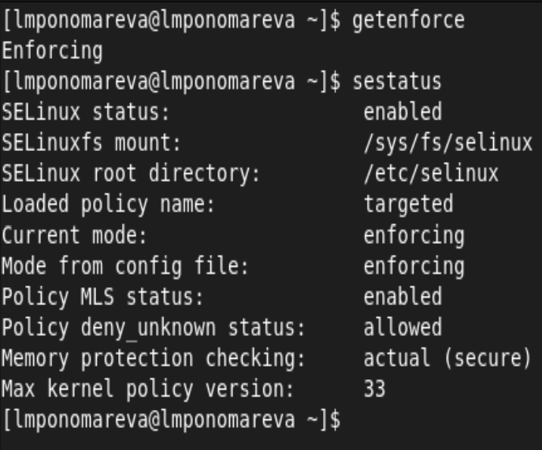
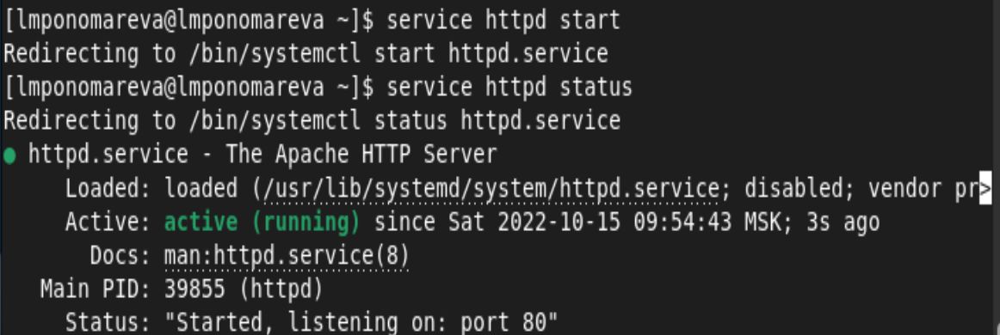
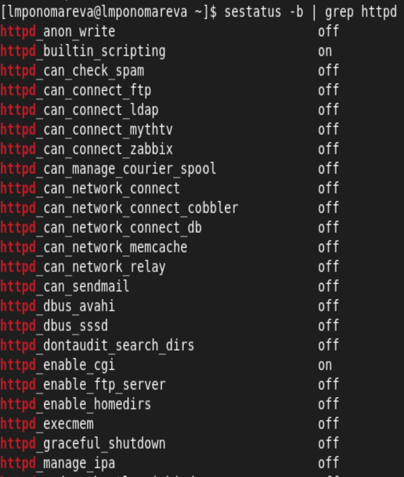
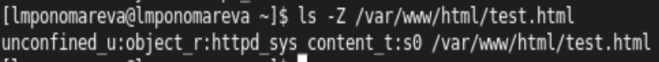
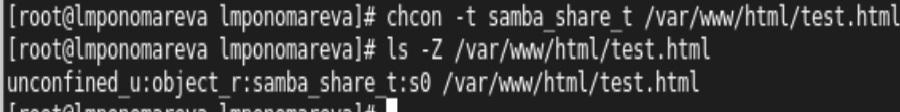
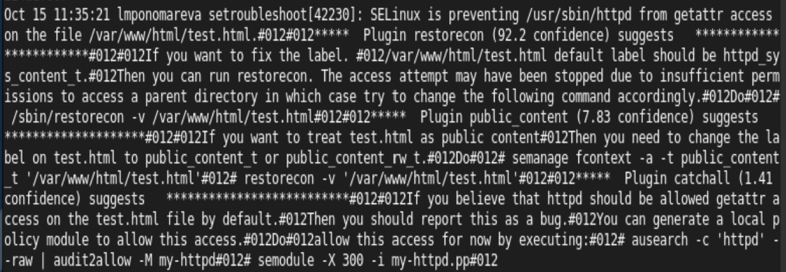
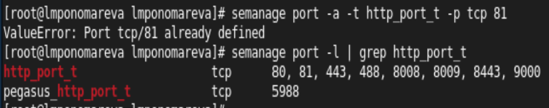
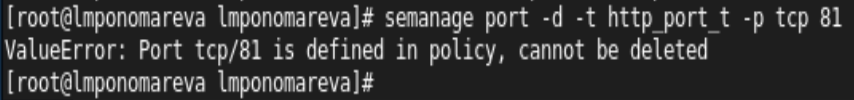

## Лабораторная работа №6
### Мандатное разграничение прав в Linux
Выполнила: Пономарева Лилия Михайловна
НПИбд-02-19
___

### Цель работы

Развить навыки администрирования ОС Linux. Получить первое практическое знакомство с технологией SELinux1. Проверить работу SELinux на практике совместно с веб-сервером Apache.
___

### Убедилась, что SELinux работает в режиме enforcing политики targeted

___

### Запустила веб-сервер

___

### Нашла веб-сервер Apache в списке процессов

___

### Текущее состояние переключателей SELinux для Apache

___

### Статистика по политике

___

### Тип поддиректорий в директории /var/www 

___

### Круг пользователей с разрешением на создание файлов в /var/www/html

___

### Создала html-файл /var/www/html/test.html

___

### Проверила контекст созданного файла

___

### Обратилась к файлу через веб-сервер

___

### Man httpd_selinux

___

### Изменила контекст файла /var/www/html/test.html

___

### Обратилась к файлу через веб-сервер

___

### Log-файлы веб-сервера Apache

___

### Посмотрела системный лог-файл

___

### Запустила веб-сервер Apache на прослушивание ТСР-порта 81

___

### Добавила порт 81 в список портов

___

### Перезапустила Apache

___

### Вернула контекст httpd_sys_cоntent__t

___

### Обратилась к файлу через веб-сервер

___

### Исправила конфигурационный файл apache

___

### Попробовала удалить привязку http_port_t к 81 порту

___

### Удалила файл /var/www/html/test.html

___

### Вывод

Получили практическое знакомство с технологией SELinux1. Проверили работу SELinx на практике совместно с веб-сервером Apache.

