---
## Front matter
title: "Лабораторная работа №6"
subtitle: "Мандатное разграничение прав в Linux"
author: "Пономарева Лилия Михайловна"

## Generic options
lang: ru-RU
toc-title: "Содержание"

## Bibliography
bibliography: bib/cite.bib
csl: pandoc/csl/gost-r-7-0-5-2008-numeric.csl

## Pdf output format
toc: true # Table of contents
toc-depth: 2
lof: true # List of figures
lot: false # List of tables
fontsize: 12pt
linestretch: 1.5
papersize: a4
documentclass: scrreprt
## I18n polyglossia
polyglossia-lang:
  name: russian
  options:
	- spelling=modern
	- babelshorthands=true
polyglossia-otherlangs:
  name: english
## I18n babel
babel-lang: russian
babel-otherlangs: english
## Fonts
mainfont: PT Serif
romanfont: PT Serif
sansfont: PT Sans
monofont: PT Mono
mainfontoptions: Ligatures=TeX
romanfontoptions: Ligatures=TeX
sansfontoptions: Ligatures=TeX,Scale=MatchLowercase
monofontoptions: Scale=MatchLowercase,Scale=0.9
## Biblatex
biblatex: true
biblio-style: "gost-numeric"
biblatexoptions:
  - parentracker=true
  - backend=biber
  - hyperref=auto
  - language=auto
  - autolang=other*
  - citestyle=gost-numeric
## Pandoc-crossref LaTeX customization
figureTitle: "Рис."
tableTitle: "Таблица"
listingTitle: "Листинг"
lofTitle: "Список иллюстраций"
lotTitle: "Список таблиц"
lolTitle: "Листинги"
## Misc options
indent: true
header-includes:
  - \usepackage{indentfirst}
  - \usepackage{float} # keep figures where there are in the text
  - \floatplacement{figure}{H} # keep figures where there are in the text
---

# Цель работы

Развить навыки администрирования ОС Linux. Получить первое практическое знакомство с технологией SELinux1. Проверить работу SELinux на практике совместно с веб-сервером Apache. [[1]](#список-литературы)

# Теоретическое введение

Security Enhanced Linux, или SELinux – это усовершенствованный механизм контроля доступа, встроенный в большинство современных дистрибутивов Linux.

SELinux реализует так называемый MAC (Mandatory Access Control). Это разграничение контроля внедряется поверх того, что уже есть в каждом дистрибутиве Linux, DAC (Discretionary Access Control).

По сути, в традиционной модели избирательного управления доступом (DAC), хорошо реализованы только два уровня доступа — пользователь и суперпользователь. Нет простого метода, который позволил бы устанавливать для каждого пользователя необходимый минимум привилегий.

Основные термины, использующиеся в SELinux:

*Домен* — список действий, которые может выполнять процесс. Обычно в качестве домена определяется минимально-возможный набор действий, при помощи которых процесс способен функционировать. Таким образом, если процесс дискредитирован, злоумышленнику не удастся нанести большого вреда.

*Роль* — список доменов, которые могут быть применены. Если какого-то домена нет в списке доменов какой-то роли, то действия из этого домена не могут быть применены.

*Тип* — набор действий, которые допустимы по отношения к объекту. Тип отличается от домена тем, что он может применяться к пайпам, каталогам и файлам, в то время как домен применяется к процессам.

Контекст безопасности — все атрибуты SELinux — роли, типы и домены.

Система SELinux может работать в любом из трех доступных режимов:
- Enforcing
- Permissive
- Disabled

В режиме *enforcing* SELinux применяет свою политику в системе Linux и следит за тем, чтобы все попытки несанкционированного доступа со стороны пользователей и процессов были запрещены. Отказы в доступе регистрируются в соответствующих логах. 

Режим *permissive* – это такое полуоткрытое состояние: в этом режиме SELinux не применяет свою политику, поэтому не блокирует доступ. Однако любое нарушение политики будет зарегистрировано в логах. 

Режим *disabled* – система отключена.

SELinux по-умолчанию работает в режиме Enforcing, когда любые действия, кроме разрешенных, автоматически блокируются, каждая программа, пользователь или сервис обладают только теми привилегиями, которые необходимы им для функционирования, но не более того. Это довольно жесткая политика, которая обладает как плюсами — наибольший уровень информационной безопасности, так и минусами — конфигурирование системы в таком режиме сопряжено с большими трудозатратами системных администраторов, к тому же, велик риск того, что пользователи столкнутся с ограничением доступа, если захотят использовать систему хоть сколько-нибудь нетривиальным образом.

# Выполнение лабораторной работы

1. Вошла в систему с полученными учётными данными и убедилась, что
SELinux работает в режиме enforcing политики targeted с помощью команд getenforce и sestatus. ([рис. 1](../../image/1.png))

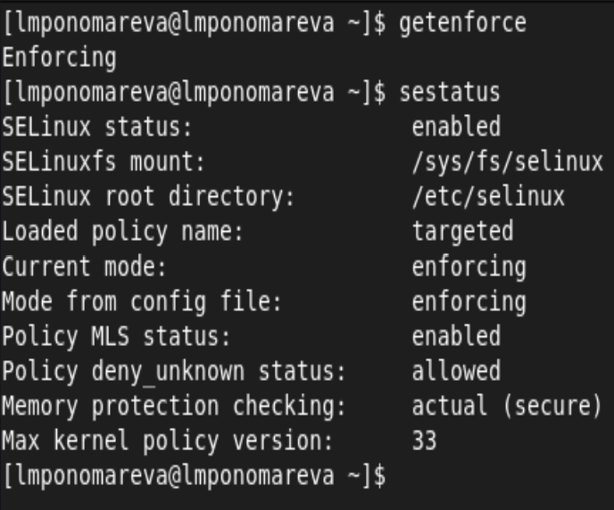{ #fig:001 width=80% height=80% }

2. Запустила веб-сервер. Обратилась с помощью браузера к веб-серверу, запущенному на компьютере, и убедилась, что последний работает: service httpd status. ([рис. 2](../../image/2.png)).

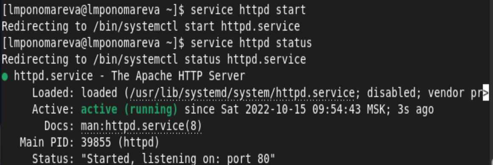{ #fig:001 width=80% height=80% }

3. Нашла веб-сервер Apache в списке процессов. ([рис. 3](../../image/3.png)).

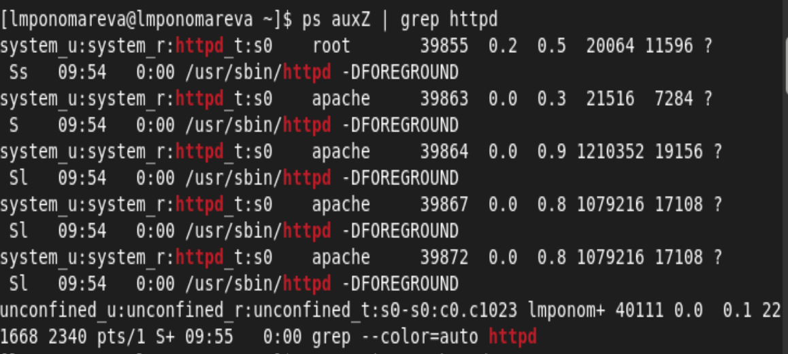{ #fig:001 width=80% height=80% }

Контекст безопасности: system_u:system_r:httpd_t:s0

4. Посмотрела текущее состояние переключателей SELinux для Apache с
помощью команды sestatus -b | grep httpd. ([рис. 4](../../image/4.png)).

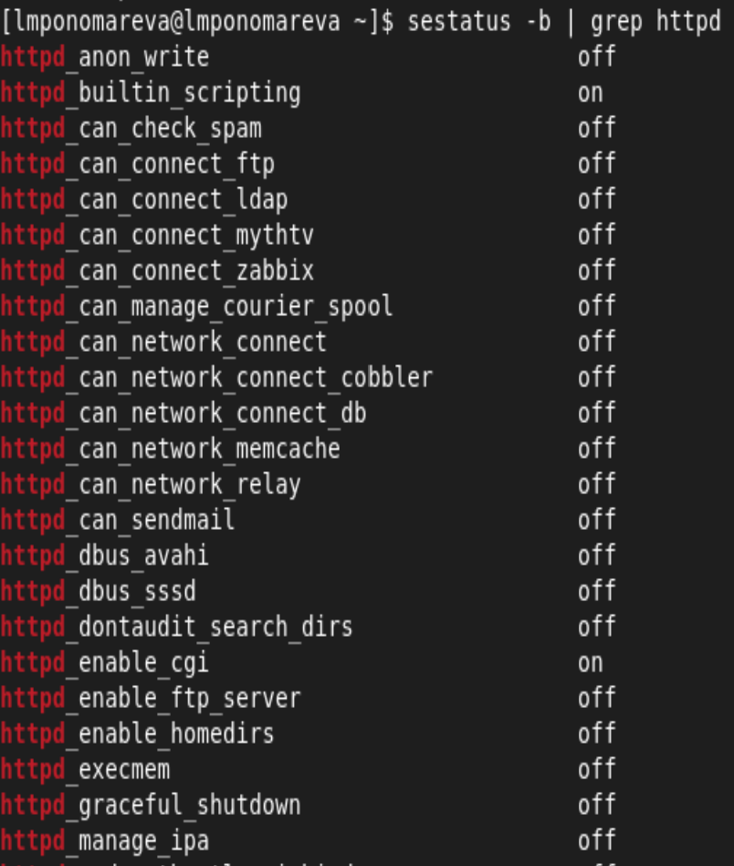{ #fig:001 width=80% height=80% }

Многие из них находятся в положении «off»

5. Посмотрела статистику по политике с помощью команды seinfo. ([рис. 5](../../image/5.png)).

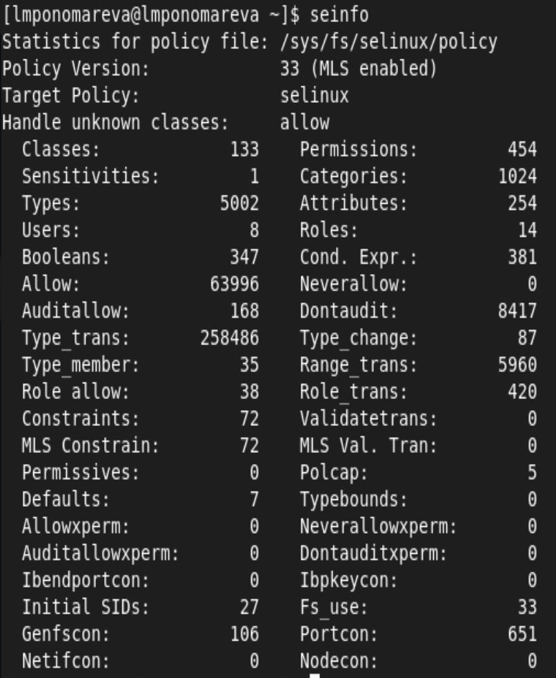{ #fig:001 width=80% height=80% }

Множество пользователей - 8  
Ролей - 14
Типов - 5002

6. Определила тип файлов и поддиректорий, находящихся в директории
/var/www, с помощью команды ls -lZ /var/www ([рис. 6](../../image/6.png)).

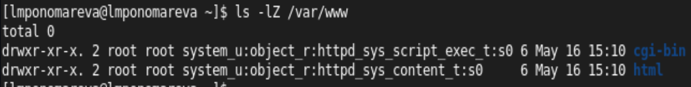{ #fig:001 width=80% height=80% }

7. Определила тип файлов, находящихся в директории /var/www/html:
ls -lZ /var/www/html ([рис. 7](../../image/7.png)).

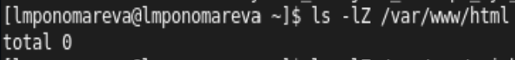{ #fig:001 width=80% height=80% }

8. Определила круг пользователей, которым разрешено создание файлов в
директории /var/www/html. ([рис. 8](../../image/6.png)).

{ #fig:001 width=80% height=80% }

Создавать файлы в директории может только её владелец.

9. Создала от имени суперпользователя (так как в дистрибутиве после установки только ему разрешена запись в директорию) html-файл
/var/www/html/test.html следующего содержания: ([рис. 9](../../image/8.png)).

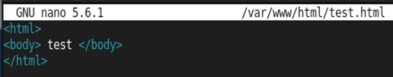{ #fig:001 width=80% height=80% }

10. Проверила контекст созданного файла. ([рис. 10](../../image/9.png)).

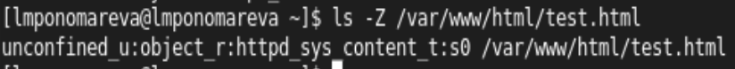{ #fig:001 width=80% height=80% }

Контекст безопасности (по умолчания для новых файлов в директории): nconfined_u:object_r:httpd_sys_content_t:s0

11. Обратилась к файлу через веб-сервер, введя в браузере адрес
http://127.0.0.1/test.html. ([рис. 11](../../image/10.png)).

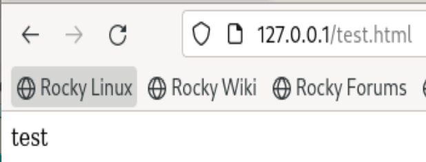{ #fig:001 width=80% height=80% }

12. Изучила справку man httpd_selinux ([рис. 12](../../image/12.png)).

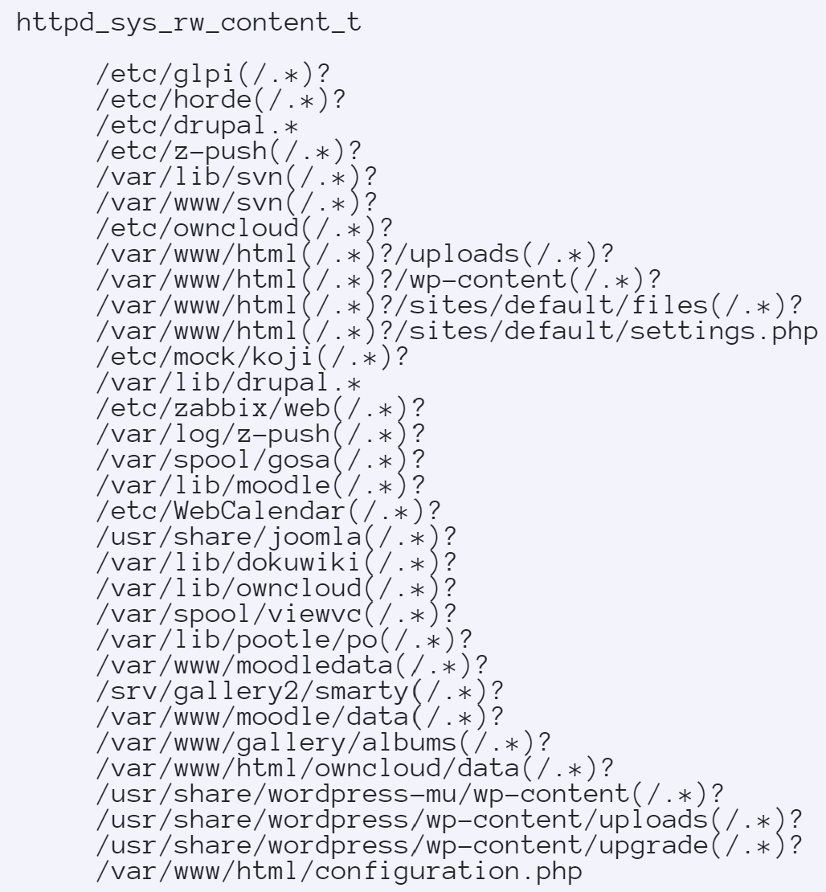{ #fig:001 width=80% height=80% }

13. Изменила контекст файла /var/www/html/test.html с httpd_sys_content_t на тот, к которому процесс httpd не имеет доступ (samba_share_t) ([рис. 13](../../image/13.png)).

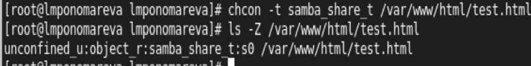{ #fig:001 width=80% height=80% }

14. Попробовала получить доступ к файлу через веб-сервер, введя в браузере адрес http://127.0.0.1/test.html. ([рис. 14](../../image/14.png)).

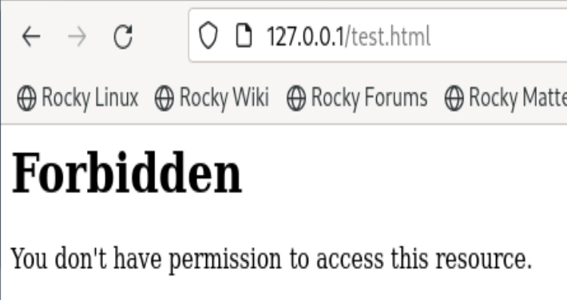{ #fig:001 width=80% height=80% }

Файл не отображен, так как к заданному типу контекста httpd не имеет доступа.

15. Просмотрела log-файлы веб-сервера Apache. ([рис. 15](../../image/17.png))

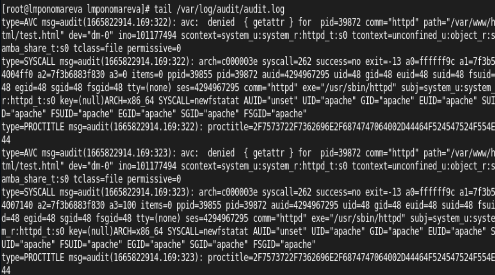{ #fig:001 width=80% height=80% }

Посмотрела системный лог-файл ([рис. 16](../../image/16.png)).

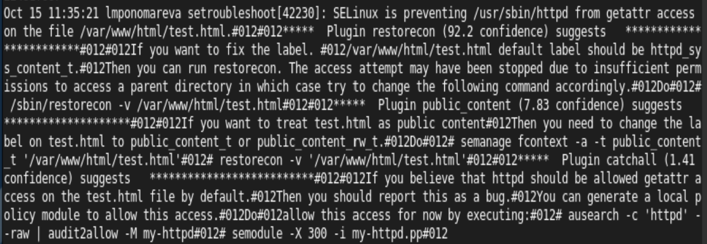{ #fig:001 width=80% height=80% }

Можем видеть как отображаются ошибки. 

16. Попробовала запустить веб-сервер Apache на прослушивание ТСР-порта
81 ([рис. 17](../../image/18.png)).

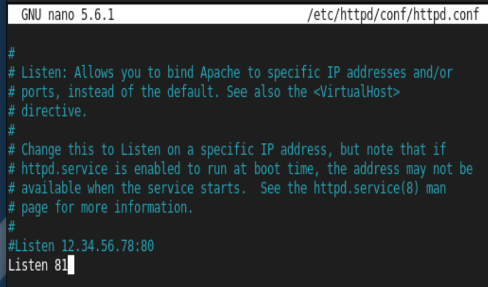{ #fig:001 width=80% height=80% }

17. Выполнила перезапуск веб-сервера Apache и посмотрела лог-файлы ([рис. 18](../../image/19.png)-[рис. 21](../../image/24.png)).

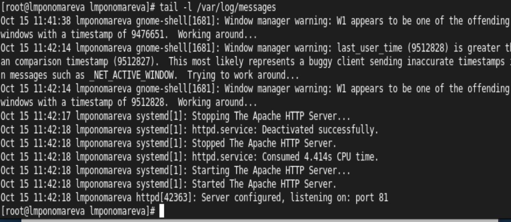{ #fig:001 width=80% height=80% }

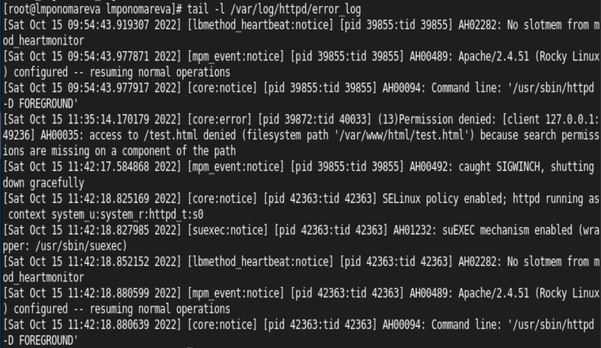{ #fig:001 width=80% height=80% }

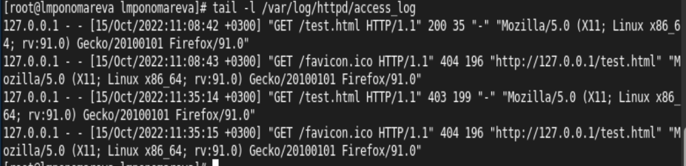{ #fig:001 width=80% height=80% }

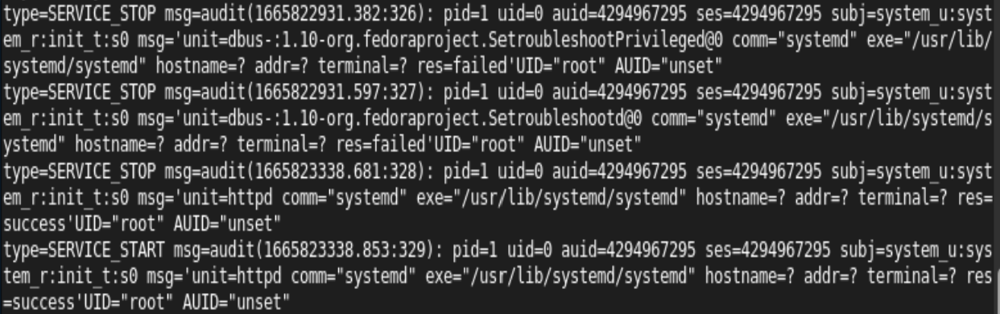{ #fig:001 width=80% height=80% }

18. Добавила порт 81 в список портов. ([рис. 22](../../image/23.png)).

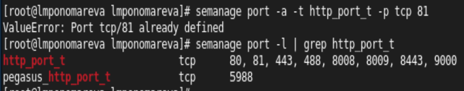{ #fig:001 width=80% height=80% }

19. Запустила веб-сервер Apache ещё раз. ([рис. 23](../../image/24.png)).

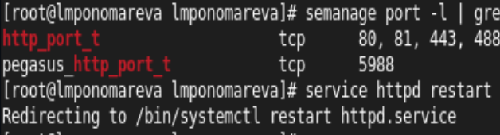{ #fig:001 width=80% height=80% }

20. Вернула контекст httpd_sys_cоntent__t к файлу /var/www/html/ test.html: ([рис. 24](../../image/26.png)).

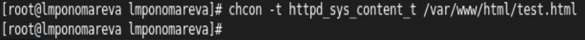{ #fig:001 width=80% height=80% }

Попробовала получить доступ к файлу через веб-сервер по 81 порту ([рис. 25](../../image/25.png)).

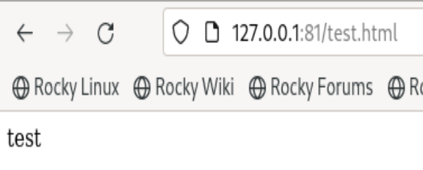{ #fig:001 width=80% height=80% }

21. Исправила обратно конфигурационный файл apache ([рис. 26](../../image/27.png)).

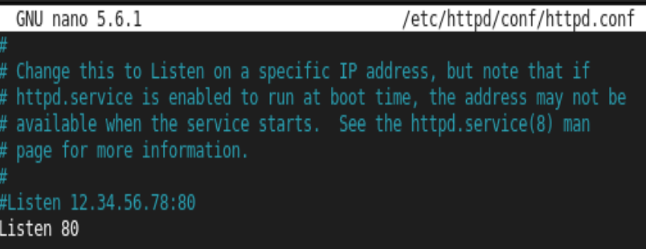{ #fig:001 width=80% height=80% }

22. Попробовала удалить привязку http_port_t к 81 порту ([рис. 27](../../image/28.png)).

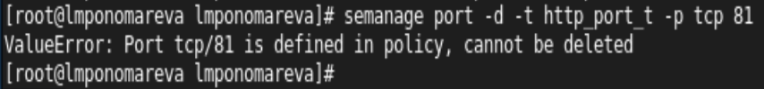{ #fig:001 width=80% height=80% }

23. Удалила файл /var/www/html/test.html ([рис. 28](../../image/29.png)).

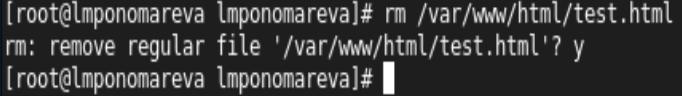{ #fig:001 width=80% height=80% }

# Выводы

Получили практическое знакомство с технологией SELinux1. Проверили работу SELinx на практике совместно с веб-сервером Apache.

# Список литературы{.unnumbered}

1. [Основы безопасности информационных систем : Учеб. пособие для студентов вузов, обучающихся по специальностям "Компьютер. безопасность" и "Комплекс. обеспечение информ. безопасности автоматизир. систем" / Д.А. Зегжда, А.М. Ивашко. - М. : Горячая линия - Телеком, 2000. - 449, [2] с. : ил., табл.; 21 см.; ISBN 5-93517-018-3](https://search.rsl.ru/ru/record/01000682756).

::: {#refs}
:::
